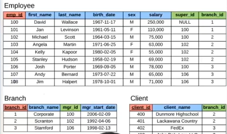

## Core Data Types of SQl
- **INT**           --   Whole Numbwe
- **DECIMAL(M,N)**  --   M $to$ Total Number of Digits, N $to$ Number of Digits after Decimal
- **VARCHAR(l)**    --   String of text of length l
- **BLOB**          --   Binary Large Object, Stores large data
- **DATE**          --   YYYY-MM-DD
- **TIMESTAMP**     --   YYYY-MM-DD HH:MM:SS - used for recordings

## Data Definition Language
```sql
-- 1. CREATE Command
    CREATE DATABASE db_name;
    CREATE TABLE student(student_id INT AUTO_INCREMENT PRIMARY KEY, name VARCHAR(20) NOT NULL, major VARCHAR(20) DEFAULT 'undecided');
-- 2. DROP Command
    DROP TABLE student;
    DROP DATABASE db_name;
-- 3. ALTER Command
    ALTER TABLE student ADD gpa DECIMAL(4,2);
    ALTER TABLE student DROP (COLUMN) gpa;  /*using column keyword is not neccessary*/
```

## Data Manipulation Language
```sql
-- 1. INSERT Command
    INSERT INTO student VALUES(1, 'Vivek', 'CS');
    INSERT INTO student(student_id, name) VALUES(2, 'Vivek2'); /*POV : don't know major*/
-- 2. UPDATE Command
    UPDATE student SET major = 'IT' WHERE student_id = 2;
    UPDATE student SET major = 'Comp. SCi.' WHERE major = 'CS';
    UPDATE student SET major = 'C.S./I.T.' WHERE major = 'Comp. Sci.' OR major = 'IT';
    UPDATE student SET major = 'undecided';
-- 3. DELETE Command
    DELETE FROM student WHERE student_id = 2;
    DELETE FROM student; /* POV : Delete all rows from the table*/
```

## DATA Query Language
```sql
-- 1. SELECT & FROM & WHERE Command
    SELECT * FROM student; 
    SELECT student_id FROM student;
    SELECT name AS student_name FROM student;
-- 2. WHERE Command
    SELECT name FROM student WHERE major = 'Comp. Sci.';
-- 3. ORDER BY Command
    SELECT student.name, student.major FROM student ORDER BY name DESC;
-- 4. GROUP BY Command
    SELECT COUNT(sex), sex FROM student GROUP BY sex /*POV : Find how many males and females students*/
-- Having Command
    SELECT emp_name, SUM(working_hours) AS "Total working hours"  FROM employees GROUP BY emp_name HAVING SUM(working_hours)>5;
    /*[Visit](https://www.javatpoint.com/mysql-having)*/
```

## Maths Functions
- **POWER()** : `SELECT POWER(student_id, 2) AS power FROM student;`
- **ROUND()** : `SELECT ROUND(100.61) AS Rounded_Number;` Output: 101, `SELECT ROUND(-1567.1160, 2) AS Rounded_Number;` Output: -1567.12
- **MOD()** : `SELECT 27 % 4 AS Remainder;` OR `SELECT 27 MOD 4 AS Remainder;` Same Output: 3

## TEXT Functions
- **UCASE() or UPPER()** : `SELECT UCASE(name) FROM student;` or `SELECT UPPER(name) FROM student;`
- **LCASE() or LOWER()** : `SELECT LCASE(name) FROM student;` or `SELECT LOWER(name) FROM student;`
- **MID()** : `SELECT MID('geeksforgeeks', 1, 5) As SUBSTRING;` Output: geeks OR `SELECT MID('geeksforgeeks', -8,3) As SUBSTRING;` Output: fun
- **SUBSTR()** : `SELECT SUBSTR('geeksforgeeks', 1, 5) As SUBSTRING;` Output: geeks OR `SELECT SUBSTR('geeksforgeeks', -8,3) As SUBSTRING;` Output: fun
- **SUBSTR()** : `SELECT SUBSTRING('geeksforgeeks', 1, 5) As SUBSTRING;` Output: geeks OR `SELECT SUBSTRING('geeksforgeeks', -8,3) As SUBSTRING;` Output: fun
- **LENGTH()** : `SELECT LENGTH("GEEKSFORGEEKS");` Output: 13
- **LEFT()** : `SELECT LEFT("geeksforgeeks", 5) AS Left_String;` Output: geeks
- **RIGHT()** : `SELECT LEFT("geeksforgeeks", 4) AS Right_String;`  Output: eeks
- **INSTR()** : `SELECT INSTR("SQL is a powerful Language", "powerful") AS Found;` Output: 10
- **TRIM()** : `TRIM([{BOTH | LEADING | TRAILING} [remstr] FROM] str)`
    1. *Example-1* : TRIM() function to remove only leading spaces.
    - `SELECT TRIM(LEADING FROM "    www.geeksforgeeks.org    ") AS TrimmedString;` Output: "www.geeksforgeeks.org    "
    2. *Example-2* : TRIM() function to remove only trailing spaces.
    - `SELECT TRIM(TRAILING FROM "    www.geeksforgeeks.org    ") AS TrimmedString;` Output: "    www.geeksforgeeks.org"
    3. *Example-3* : TRIM() function to remove both leading and trailing spaces.
    - `SELECT TRIM("    www.geeksforgeeks.org    ") AS TrimmedString;` Output: "www.geeksforgeeks.org"
- **LTRIM()** : `SELECT LTRIM ('    geeksforgeeks     ')  AS LeftTrimmedString;` Output: 'geeksforgeeks    '
- **RTRIM()** : `SELECT LTRIM ('    geeksforgeeks     ')  AS RightTrimmedString;` Output: '    geeksforgeeks'

## Date Functions
- **DATE()** : `SELECT DATE('2020-06-23'); as date`
- **NOW()** : `SELECT NOW() as current` Output Format: yyyy-mm-dd hh:mm:ss
- **MONTH()** : `SELECT MONTH(NOW()) AS Current_Month;` or `SELECT MONTH('2015-09-26 08:09:22') AS MONTH;` Output: 9
- **MONTHNAME()** : `SELECT MONTHNAME(NOW()) AS Current_Month_Name;` or `SELECT MONTHNAME('2015-09-26 08:09:22') AS MONTHNAME;` Output: September
- **YEAR()** : `SELECT YEAR(NOW()) AS Current_Year;` or `SELECT YEAR('2015-09-26 08:09:22') AS YEAR;` Output: 2015
- **DAY()** : `SELECT DAY(NOW()) AS Today;` or `SELECT DAY('2015-09-26 08:09:22') AS DAY;` Output: 26
- **DAYNAME()** : `SELECT DAYNAME(NOW()) AS Today_Name;` or `SELECT DAYNAME('2015-09-26 08:09:22') AS DAY_NAME;` Output: Saturday

## Aggregate Functions
- **MAX()** : `SELECT MAX(student_id) from student;`
- **MIN()** : `SELECT MIN(student_id) from student;`
- **AVG()** : `SELECT AVG(student_id) from student;`
- **SUM()** : `SELECT SUM(student_id) from student;`
- **COUNT()** : `SELECT COUNT(student_id) from student;`

## Wildcards
```sql
-- % = any # characters
-- Find any student who is Tripathi.
    SELECT * FROM student WHERE student.name LIKE '%Tripathi';
-- _ = one characters
-- Find any studetn born in january.
    SELECT * FROM student WHERE birth_date LIKE '____-01%';
```

## Operations on Relations
### Union
```sql
-- Find name of all student and teachers in the school
    SELECT student.name FROM student AS names UNION SELECT techer.name FROM teacher
```
### Joins

```sql
-- Find all bracnch and name of the 
    SELECT employee.emp_id, employee.first_name, branch.branch_name FROM employee JOIN branch ON employee.emp_id = branch.mgr_id
```
### Intersection
```sql
    SELECT emp_id FROM employee INTERSECT SELECT mgr_if FROM branch  /*Output - 100, 102, 106*/
```
### Minus
```sql
    SELECT emp_id from employee MINUS SELECT mgr_id FROM branch   /*Output - 101, 103, 104, 105, 107, 108*/
```
### Cartesian Product
```sql
    SELECT * FROM employee CROSS JOIN branch    /*Cartesian Product b/w Employee Teble and Branch Table will occur*/
```