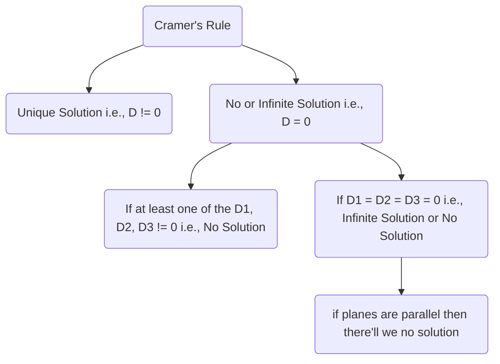
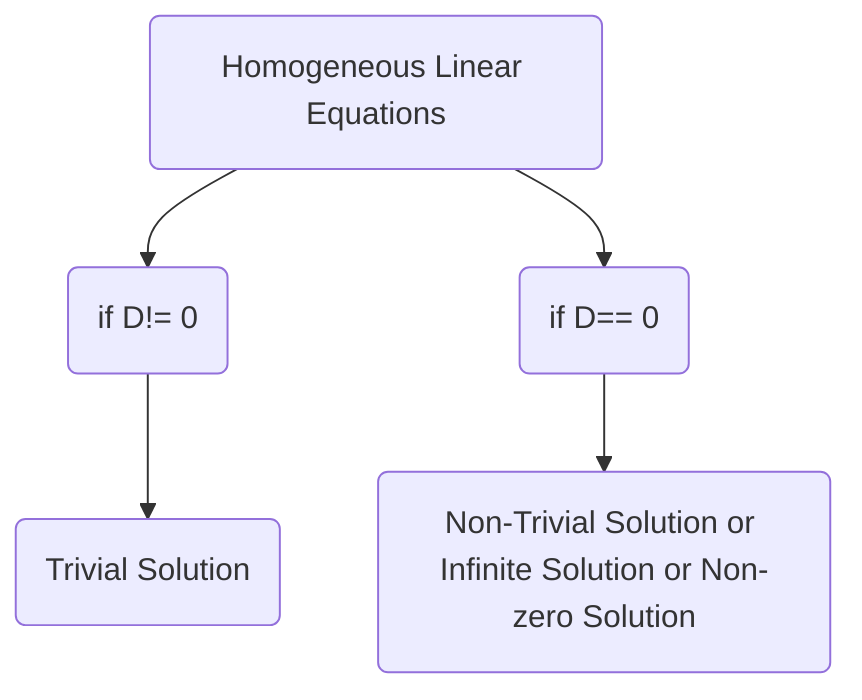
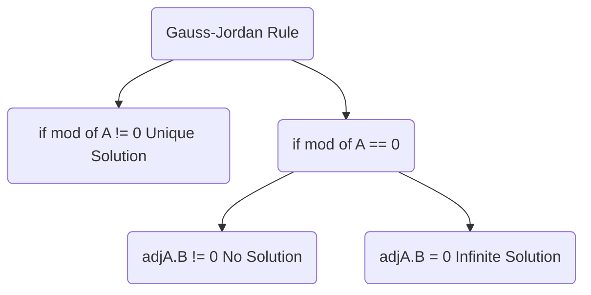

- Determinants are always square.
- Always have a Scaler Value.
- Represented by $det(A) \ || \ |A|$
- $|A| = \begin{vmatrix} a & b \\ c & d \end{vmatrix}$

## Cofactor
$C_{ij} = (-1)^{i+j} * Minor_{ij}$

### Cofactor  Property 
In a determinant the sum of the product's of the element's of any row(column) with their corresponding cofactor's equal to the value of the determinant.
$a_{11}c_{11} + a_{22}c_{22}  + a_{33}c_{33}  = \triangle (Determinant)$.
$a_{11}c_{31} + a_{12}c_{32}  + a_{13}c_{33}  = 0$.

### Properties of Determinant
1. $|A| = |A^{T}| \ and \ |A| = 1$
2. If any two rows (or columns) of the determinant **be interchanged**, the value of the determinant is **changed in sign only**.
3. If rows and columns are rotated in cyclic order then value of the determinant is **unchanged**.
4. If a determinant has **any two rows(or columns) identical**, then its **value is zero**.
5. **Scalar multiplication:** scaler will be multiplied in any one row (or column).
6. $|kA| = k^{n} \ * \ |A|$, where n is order of A.
7. The value of a skew symmetric determinant of odd order is zero.
8. **Adding Determinants** If there are determinants of order 3, then there must be minimum 2 rows (or column) should same. i.e., 

$$
\begin{vmatrix} a_{1} & b_{1} & c_{1} \\
a_{2} & b_{2} & c_{2} \\
a_{3} & b_{3} & c_{3}\end{vmatrix} \ + \ \begin{vmatrix}x & y & z \\
a_{2} & b_{2} & c_{2} \\
a_{3} & b_{3} & c_{3}\end{vmatrix} \ = \ \begin{vmatrix} a_{1} + x & b_{1} + y & c_{1} + z \\
a_{2} & b_{2} & c_{2} \\
a_{3} & b_{3} & c_{3}\end{vmatrix}
$$

9. **Splitting Determinant:**

$$\begin{vmatrix} a_{1} + x & b_{1} + y & c_{1} + z \\
a_{2} & b_{2} & c_{2} \\
a_{3} & b_{3} & c_{3} \end{vmatrix} \ = \ \begin{vmatrix} a_{1} & b_{1} & c_{1} \\
a_{2} & b_{2} & c_{2} \\
a_{3} & b_{3} & c_{3}\end{vmatrix} \ + \ \begin{vmatrix}x & y & z \\ 
a_{2} & b_{2} & c_{2} \\ 
a_{3} & b_{3} & c_{3}\end{vmatrix}$$

10. $|AB| = |A| |B|$
11. If $det(A)$ = 0, then A is known as a **singular matrix**.

## Special Determinants
1. 
$$\begin{bmatrix} 1 & x & x^{2} \\
  1 & y & y^{2} \\
  1 & z & z^{2} \end{bmatrix} = (x-y)(y-z)(z-x)$$

2. 
$$\begin{bmatrix} 1 & x & x^{3} \\
  1 & y & y^{3} \\ 
  1 & z & z^{3} \end{bmatrix} = (x-y)(y-z)(z-x)(x+y+z)$$

3. 
$$\begin{bmatrix} a & b & c \\ 
b & c & a \\ 
c & a & b \end{bmatrix} = -(a^{3} + b^{3} + c^{3} - 3abc)$$

## Method to solve system of Linear Equation
	1. Cramer's Rule : Determinant Method
	2. Gauss-Jordan Rule : Metrix Method

### Cramer's Rule

$a_{1}x +b_{1}y + c_{1}z = d_{1}$ 

$a_{2}x +b_{2}y + c_{2}z = d_{2}$ 

$a_{3}x +b_{3}y + c_{3}z = d_{3}$	

then, $x = \frac{D_{1}}{D}$, $y = \frac{D_{2}}{D}$, $z = \frac{D_{}}{D}$.

$$D = \begin{vmatrix} a_{1} & b_{1} & c_{1} \\
a_{2} & b_{2} & c_{2} \\
a_{3} & b_{3} & c_{3} \end{vmatrix},  D_{1} = \begin{vmatrix} d_{1} & b_{1} & c_{1} \\
d_{2} & b_{2} & c_{2} \\
d_{3} & b_{3} & c_{3} \end{vmatrix},  D_{2} = \begin{vmatrix} a_{1} & d_{1} & c_{1} \\
a_{2} & d_{2} & c_{2} \\
a_{3} & d_{3} & c_{3} \end{vmatrix},  D_{3} = \begin{vmatrix} a_{1} & b_{1} & d_{1} \\
a_{2} & b_{2} & d_{2} \\
a_{3} & b_{3} & d_{3} \end{vmatrix}$$

	1. Consistent: solution exists (unique or infinite)
	2. Incinsistent: soluton does not exists (No Solution)
	3. Homogeneous equation: constant terms are zero i.e., d1 = 0, d2 = 0, d3 = 0.
	4. Trivial equation: all variables are zero i.e., x = 0, y = 0, z = 0.

### Gauss-Jordan Rule

$x + y + z = 6$ 

$x - y + z = 2$ 

$2x + y - z = 1$	

$$\begin{bmatrix} 1 & 1 & 1 \\ 
1 & -1 & 1 \\ 
2 & 1 & -1 \end{bmatrix} \ \begin{bmatrix} x \\
y \\ 
z \end{bmatrix} \  = \ \begin{bmatrix} 6 \\
2 \\ 
1 \end{bmatrix}$$

$AX = B$
$A^{-1}.A.X = A^{-1}.B$
$X = \frac{adj(A).B}{|A|}$

### Differentiation of Determinant

$$F(x) = \begin{vmatrix} f_{1}(x) & f_{2}(x) & f_{3}(x) \\ 
g_{1}(x) & g_{2}(x) & g_{3}(x) \\ 
h_{1}(x) & h_{2}(x) & h_{3}(x) \end{vmatrix}$$

Differentiation of determinant can found differentiating single row(column) at a time a add them up i.e.,

$$F'(x) = \begin{vmatrix} f_{1}'(x) & f_{2}'(x) & f_{3}'(x) \\ 
g_{1}(x) & g_{2}(x) & g_{3}(x) \\ 
h_{1}(x) & h_{2}(x) & h_{3}(x) \end{vmatrix} + \begin{vmatrix} f_{1}(x) & f_{2}(x) & f_{3}(x) \\ 
g_{1}'(x) & g_{2}'(x) & g_{3}'(x) \\ 
h_{1}(x) & h_{2}(x) & h_{3}(x) \end{vmatrix} + \begin{vmatrix} f_{1}(x) & f_{2}(x) & f_{3}(x) \\ 
g_{1}(x) & g_{2}(x) & g_{3}(x) \\ 
h_{1}'(x) & h_{2}'(x) & h_{3}'(x) \end{vmatrix}$$

OR 

$$F'(x) = \begin{vmatrix} f_{1}'(x) & f_{2}(x) & f_{3}(x) \\ 
g_{1}'(x) & g_{2}(x) & g_{3}(x) \\ 
h_{1}'(x) & h_{2}(x) & h_{3}(x) \end{vmatrix} + \begin{vmatrix} f_{1}(x) & f_{2}'(x) & f_{3}(x) \\ 
g_{1}(x) & g_{2}'(x) & g_{3}(x) \\ 
h_{1}(x) & h_{2}'(x) & h_{3}(x) \end{vmatrix} + \begin{vmatrix} f_{1}(x) & f_{2}(x) & f_{3}'(x) \\ 
g_{1}(x) & g_{2}(x) & g_{3}'(x) \\ 
h_{1}(x) & h_{2}(x) & h_{3}'(x) \end{vmatrix}$$

## Cayley - Hamilton Theorem
Every square matrix satisfies a specific polynomial equation known as characteristic equation.
$P(\lambda) = |A- \lambda.I|$ 
$P(A) = 0$
- Often used to find $A^{-1} \ and \ A^{badi \ badi \ power}$ 
