## Trigonometry
**Trigonometry** is a branch of mathematics in which we study about the measurements inside triangle i.e., measurement of sides, angles, area, etc.

$$\mathcal{Trigonometry} \longrightarrow \underbrace{\mathcal{Trigon}}_{\Delta} + \underbrace{\mathcal{Metron}}_{\mathcal{Measurement}}$$

## System Of Angle Measurement
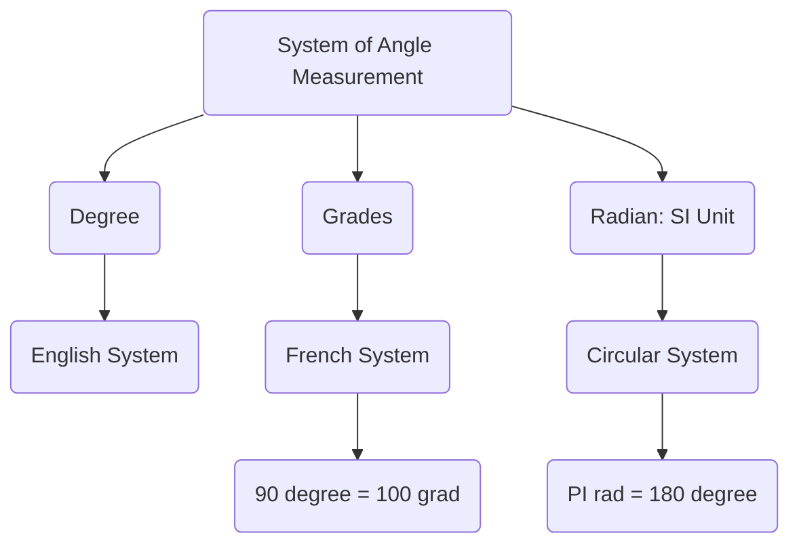

$Radian\ Measure \ = \ \frac \pi {180} \ * \ Degree \ Measure$
$Degree\ Measure \ = \ \frac {180} \pi  \ * \ Radian \ Measure$

### Length of Arc
- $l = r\theta$
- $\theta$ should be in $\pi$ radian.
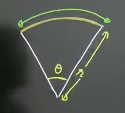

### Area of Sector
- $Area of Sector = \frac{1}{2}\ \theta\ r^{2}$ 
- $\theta$ should be in $\pi$ radian.

## Trigonometric Identities
- $\sin^{2}\theta + cos^{2}\theta = 1$ 
- $sec^{2}\theta - tan^{2}\theta = 1$ 
- $cosec^{2}\theta - cot^{2}\theta = 1$ 
- $\sin^{4}\theta + cos^{4}\theta = 1 - 2\sin^{2}\theta cos^{2}\theta$        #imp
- $\sin^{6}\theta + cos^{6}\theta = 1 - 3\sin^{2}\theta cos^{2}\theta$        #imp 

## Complementary Angle Identity
- $\sin(90-\theta) = cos\theta$
- $\sin(\frac{\pi}{2}- \theta) = cos\theta$
- $cos(\frac{\pi}{2}- \theta) = \sin\theta$
- $tan(\frac{\pi}{2}- \theta) = cot\theta$
- $cot(\frac{\pi}{2}- \theta) = tan\theta$
- $sec(\frac{\pi}{2}- \theta) = cosec\theta$
- $cosec(\frac{\pi}{2}- \theta) = sec\theta$

## Trigonometric Table
| $\theta$ | $0\degree$ | $30\degree \frac \pi 6$ | $45\degree \frac \pi 4$ | $60\degree \frac \pi 3$ | $90\degree \frac \pi 2$ |
|-|-|-|-|-|-|
| $Sin\theta$ | 0 | $\frac{1}{2}$ | $\frac{1}{\sqrt{2}}$ | $\frac{\sqrt{3}}{2}$ | 1 |
| $Cos\theta$ | 1 | $\frac{\sqrt{3}}{2}$ | $\frac{1}{\sqrt{2}}$ | $\frac{1}{2}$ | 0 |
| $Tan\theta$ | 0 | $\frac{\sqrt{1}}{2}$ | 1 | $\sqrt{3}$ | Not defined |
| $Cot\theta$ | Not defined | $\sqrt{3}$ | 1 | $\frac{\sqrt{1}}{2}$ | 0 |
| $Sec\theta$ | 1 | $\frac{2}{\sqrt{3}}$ | $\sqrt{2}$ | 2 | Not Defined |
| $Cosec\theta$ | Not Defined | 2 | $\sqrt{2}$ | $\frac{2}{\sqrt{3}}$ | 1 |

## Allied Angles
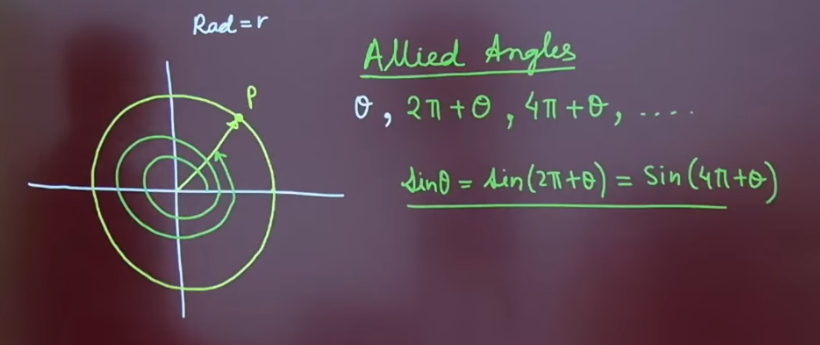

## CAST Rule 
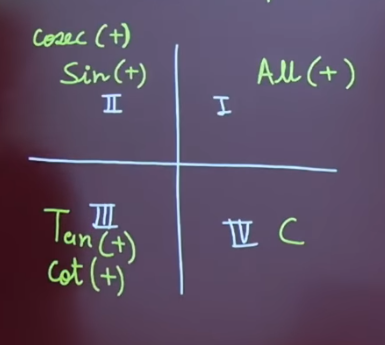
#### Rule 1 - k multiple of $\pi$
- $Sin(k\pi + \theta) = Sin\theta$            $Sin \to Sin$
- $Cos(k\pi + \theta) = Cos\theta$           $Cos \to Cos$
- $Tan(k\pi + \theta) = Tan\theta$          $Tan \to Tan$
- $Cot(k\pi + \theta) = Cot\theta$            $Cot \to Cot$
- $Sec(k\pi + \theta) = Sec\theta$            $Sec \to Sec$
- $Cosec(k\pi + \theta) = Cosec\theta$    $Cosec \to Cosec$
#### Rule 2 - k multiple of $\frac{\pi}{2}$
- $Sin(k\frac{\pi}{2} + \theta) = Cos\theta$            $Sin \leftrightarrow Cos$
- $Tan(k\frac{\pi}{2} + \theta) = Cot\theta$            $Tan \leftrightarrow Cot$
- $Sec(k\frac{\pi}{2} + \theta) = Cosec\theta$            $Sec \leftrightarrow Cosec$

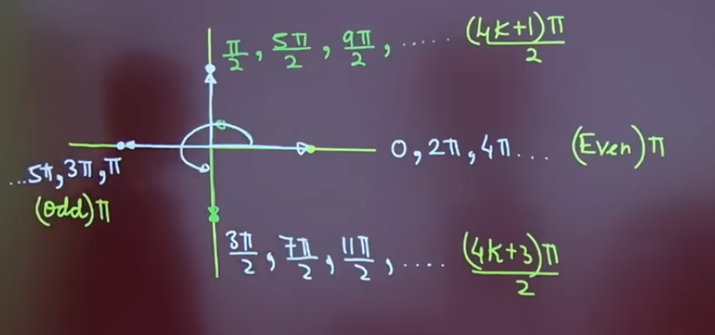

## Negative Angles
- $cos(-\theta) = cos\theta$
- $sec(-\theta) = sec\theta$
- $sin(-\theta) = -sin\theta$
- $tan(-\theta) = -tan\theta$
- $cot(-\theta) = -cot\theta$
- $cosec(-\theta) = -cosec\theta$

## Graph of Trigonometric Function

### $y = sinx$
- Domain : $x \in R$
- Range : $y \in[-1, 1]$
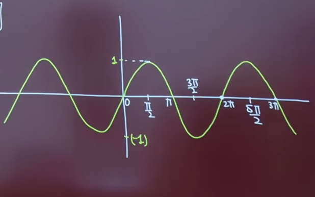

### $y = cosx$
- Domain : $x \in R$
- Range : $y \in[-1, 1]$
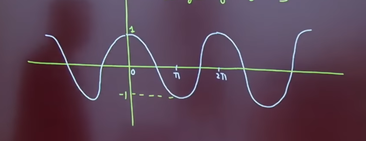

### $y = tanx$
- $tanx = \frac{sinx}{cosx} \ \ \ cosx \neq 0 \ \ \ x \neq \frac{(2n + 1)\pi}{2}$
- Increasing Function
- Domain : $x \in R- \frac{(2n + 1)\pi}{2}$
- Range : $y \in R$
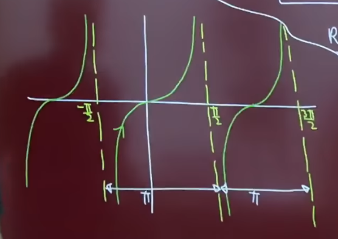

### $y = cotx$
- $cotx = \frac{cosx}{sinx} \ \ \ sinx \neq 0 \ \ \ x \neq n\pi$
- Decreasing Function
- Domain : $x \in R-{n\pi}$
- Range : $y \in R$
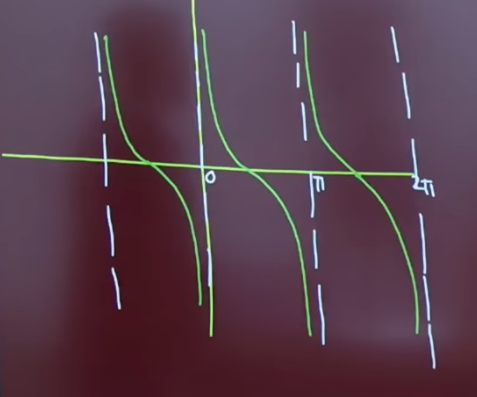

### $y = secx$
- $secx = \frac{1}{cosx} \ \ \ cosx \neq 0 \ \ \ x \neq \frac{(2n + 1)\pi}{2}$
- Domain : $x \in R-{\frac{(2n + 1)\pi}{2}}$
- Range : $y \in (\infty, -1] \cup [1, \infty)$
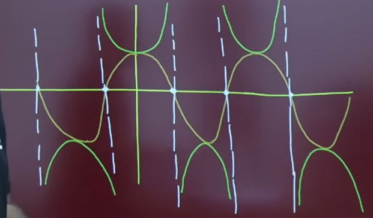

### $y = cosecx$
- $cosecx = \frac{1}{sinx} \ \ \ sinx \neq 0 \ \ \ x \neq n\pi$
- Domain : $x \in R-{n\pi}$
- Range : $y \in (\infty, -1] \cup [1, \infty)$
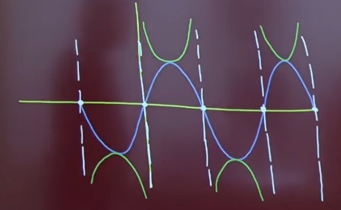

## Compound Angle Identity
- $Sin(A + B) = sinAcosB + cosAsinB$
- $Sin(A - B) = sinAcosB - cosAsinB$
- $Cos(A + B) = cosAcosB - sinAsinB$
- $Cos(A - B) = cosAcosB + sinAsinB$
- $Tan(A + B) = \frac{tanA + tanB}{1 - tanAtanB}$
- $Tan(A - B)  = \frac{tanA - TanB}{1 + tanAtanB}$
- $Cot(A + B) = \frac{cotAcotB -1}{cotB + cotA}$
- $Cot(A - B) = \frac{cotAcotB + 1}{cotB - cotA}$
- $Sec(A + B) = \frac{secAsecB}{1 - tanAtanB}$
- $Sec(A - B) = \frac{secAsecB}{1 + tanAtanB}$
- $Cosec(A + B) = \frac{cosecAcosecB}{cotA + cotB}$
- $Cosec(A - B) = \frac{cosecAcosecB}{cotB - cotA}$
- $Tan(\frac{\pi}{4} + A) = \frac{1 + tanA}{1 - tanA}$
- $Tan(\frac{\pi}{4} - A) = \frac{1 - tanA}{1 + tanA}$
- $Sin(A + B)Sin(A - B) = Sin^{2}A - Sin^{2}B$
- $Cos(A - B)Cos(B - A) = Cos^{2}A - Sin^{2}B$

###  Transformation Formula
- $Sin(A + B) + Sin(A - B) = 2sinAcosB$
- $Sin(A + B) - Sin(A - B) = 2cosAsinB$
- $Cos(A + B) + cos(A - B) = 2cosAcosB$
- $Cos(A + B) - Cos(A - B) = 2sinAsinB$
let $A + B = C$ & $A - B = D$, then
- $SinC + SinD = 2sin(\frac{C+D}{2})cos(\frac{C-D}{2})$
- $SinC - SinD = 2cos(\frac{C+D}{2})sin(\frac{C-D}{2})$
- $CosC + cosD = 2cos(\frac{C+D}{2})cos(\frac{C-D}{2})$
- $CosC - CosD = -2sin(\frac{C+D}{2})sin(\frac{C-D}{2})$
  
### $tan$ expandable formula

$$\begin{align*}tan(\theta_{1} + \theta_{2} + ... + \theta_{n}) = \frac{s_{1} - s_{3} + s_{5} ...}{1 - s_{2} + s_{4} - s_{6}...} \\
s_{1} = tan\theta_{1} + tan\theta_{2} + \theta_{3} +\ ... \ +  tan\theta_{n}\\
s_{2} = tan\theta_{1}tan\theta_{2} + tan\theta_{2}tan\theta_{3} + \ ... \ + tan\theta_{n-1}tan\theta_{n} \\
s_{3} = \ ... \\
s_{4} = \ ... \end{align*}$$

ex- 
- $tan(\theta_{1} + \theta_{2}) = \frac{s_{1}}{1 - s_{2}} = \frac{tan\theta_{1} + tan\theta_{2}}{1 - tan\theta_{1}tan\theta_{2}}$
- $tan(\theta_{1} + \theta_{2} + \theta_{3}) = \frac{s_{1} - s_{3}}{1 - s_{2}} = \frac{tan\theta_{1} + tan\theta_{2} + tan\theta_{3} - tan\theta_{1}tan\theta_{2}tan\theta_{3}}{1 - (tan\theta_{1}tan\theta_{2} + tan\theta_{2}\theta_{3})}$

## Multiple and Sub-multiple Angles

- $sin(2A) = 2sinAcosA$
- $\ \ \ \ \ \ \ \ \ \ \ \ \ \  = \frac{2tanA}{1 + tan^{2}A}$
- $cos(2A) = cos^{2}A - sin^{2}A$
- $\ \ \ \ \ \ \ \ \ \ \ \ \ \  = 1- 2sin^{2}A$
- $\ \ \ \ \ \ \ \ \ \ \ \ \ \  =2cos^{2}A - 1$
- $\ \ \ \ \ \ \ \ \ \ \ \ \ \  =\frac{1 - tan^{2}A}{1 + tan^{2}A}$
- $tan(2A) = \frac{2tanA}{1 - tan^{2}A}$
- $1 - cos(2A) = 2sin^{2}A$
- $1 + cos(2A) = 2 cos^{2}A$
- $sin(3A) = 3sinA - 4sin^{3}A$
- $cos(3A) = 4cos^3A - 3cosA$
- $tan(3A) = \frac{3tanA-tan^3A}{1-3tan^2A}$
- 
## Common Angle Value

#### $15\degree , 75\degree$
- $15\degree = \frac{\pi}{2}$
- $75\degree = \frac{5\pi}{2}$
- $sin\theta = cos(90 - \theta)$
- $sin15\degree = \frac{\sqrt{3} - 1}{2\sqrt{2}} = cos75\degree$
- $cos15\degree = \frac{\sqrt{3} + 1}{2\sqrt{2}} = sin75\degree$

#### $18\degree,\ 36\degree \ \longrightarrow \ free \  72\degree,\ 54\degree$
- $sin18\degree = cos72\degree$
- $cos18\degree = sin72\degree$
- $sin36\degree = cos54\degree$
- $sin18\degree = \frac{\sqrt{5} - 1}{4} = cos72\degree$
- $cos36\degree = \frac{\sqrt{5} + 1}{4}$
- $sin36\degree = \frac{\sqrt{10 - 2\sqrt{5}}}{4} = cos54\degree$

#### $22.5\degree = \frac{\pi}{8} = \frac{45\degree}{2}$
- $tan(\frac \pi 8 )= \sqrt{2} - 1$
- $cot(\frac \pi 8 )= \sqrt{2} + 1$

## More Formulas
- $sin(A)sin(60+A)sin(60-A) = \frac 1 4 sin3A$
- $cos(A)cos(60+A)cos(60-A) = \frac 1 4 cos3A$
- $tan(A)tan(60+A)tan(60-A) = tan3A$

## Cosine Series (Product)

$$\cos A\cos2A\cos4A\cos8A...\cos2^{n-1}A = \frac{\sin2^n A}{2^n \sin A}$$

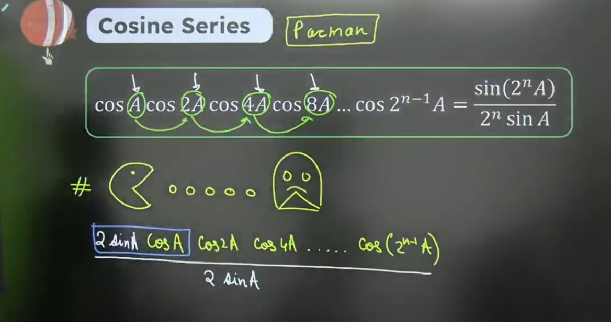

## Cosine Series (Sum)

$$cos\alpha + cos(\alpha + \beta) + cos(\alpha + 2\beta) + ... + cos(\alpha + (n-1)\beta) = \frac{sin(\frac{n\beta}{2})}{sin(\frac{\beta}{2})}cos(\alpha + \frac{(n-1)\beta}{2})$$

 where,
 - $n \to$ no. of terms
 - $\alpha \to$ **First Angle**
 - $\beta \to$ common difference
 
## Sine Series (Sum)

$$sin\alpha + sin(\alpha + \beta) + sin(\alpha + 2\beta) + ... + sin(\alpha + (n-1)\beta) = \frac{sin(\frac{n\beta}{2})}{sin(\frac{\beta}{2})}sin(\alpha + \frac{(n-1)\beta}{2})$$

 where,
 - $n \to$ no. of terms
 - $\alpha \to$ **First Angle**
 - $\beta \to$ common difference

## Cosec Series (Product)

$$cosecx + cosec2x + cosec4x + ... + cosec(2^n x) = cot(\frac x 2) - cot(2^n)$$

## Maximum and Minimum values of Trigonometric $f^n$
- if $f(x)$  = ........
- then, $Range \in [\alpha, \beta]$

#### Type 1 :- Use the range of known trigonometric function
- example - 
$f(x) = 3 + sinx$
$-1 \leq sinx \leq 1$ 
$2 \leq 3 + sinx \leq 3$
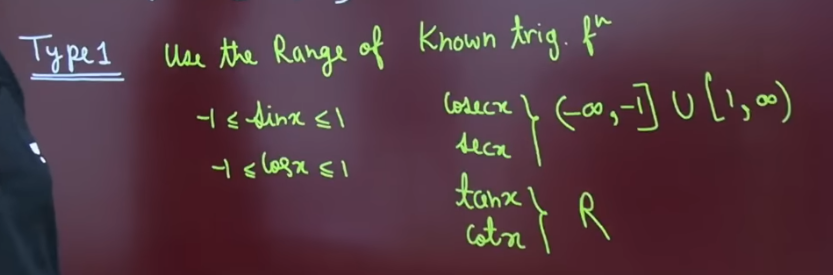
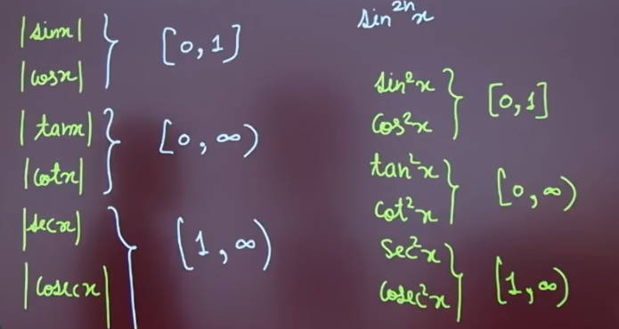

#### Type 2
- $f(x) = asinx + bcosx$
- $-\sqrt(a^2 + b^2) \leq asinx + bcosx \leq \sqrt(a^2 + b^2)$
- example-
$f(x) = 3sinx + 4cosx$
$-5 \leq 3sinx + 4cosx \leq 5$

#### Type 4
- Quadratic equation of $\sin x$ or $\cos x$.

#### Type 5
- $(a^2 tan^2\theta + b^2 cot^2\theta)_{min} = 2ab$

## Conditional Identity
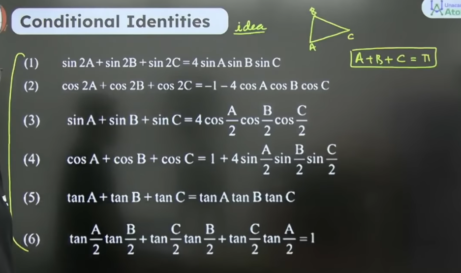