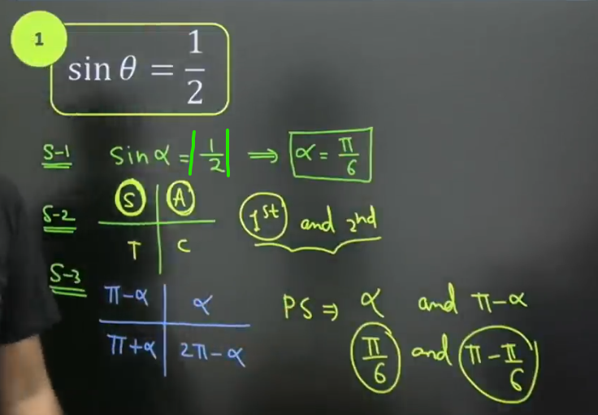
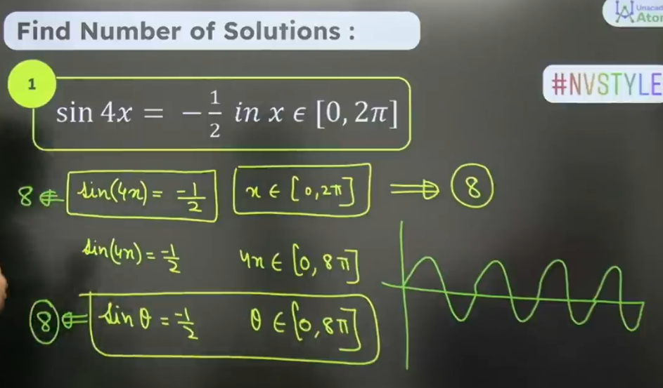

## Trigonometric Equation
	Equation :- Statement whose LHS and RHS are seperated by equals to (=) symbol

## Solution of Trigonometric Equation
	1. General SOlution
	2. Primary Solution

## Primary Solution

## General Solution
- $sinx = sin\alpha \to x = n\pi + (-1)^n \alpha$ 
- $cosx = cos\alpha \to z = 2n\pi \pm  \alpha$
- $tanx = tan\alpha \to x = n\pi + \alpha$
- $x = n\pi + \alpha \to \begin{cases} sin^2x = sin^2\alpha \\ cos^2x = cos^2\alpha \\ tan^2x = tan^2\alpha \end{cases}$

## Number of Solution

### Type 1 : Factorization / Quadratic Form
	Note: After cancelling out any part put it equls to zero to find its root.

### Type 2 : a sinx + b cosx = c
	$\frac{asinx}{\sqrt{a^2+b^2}} + \frac{acosx}{\sqrt{a^2+b^2}} = \frac{c}{\sqrt{a^2+b^2}}$ 

### Type 3 : Convert Sum to Product

### Type 4 : Convert Product to Sum

### Type 5 : $f(sinx \pm cosx , sinxcosx)$
Equation of the form $P(sinx \pm cosx, sinxcosx) = 0$, can be derived by the substituting $cosx \pm sinx = t$

### Type 6 : Using range of functions
Remember :- $-1 \le sinx \le 1, -1 \le cosx \le 1, tanx \in R, cotx \in R, |Cosecx| \ge 1, |secx| \ge 1$

## Type 7 : $f(x) = \sqrt(\phi(x))$ 
	1. Solve it by squaring on the both side.
	2. Then, check all the roots, whether they are satisfying the equation or not.

## Type 8 : Log wale Questions

### Type 9 : Graph wale Questions