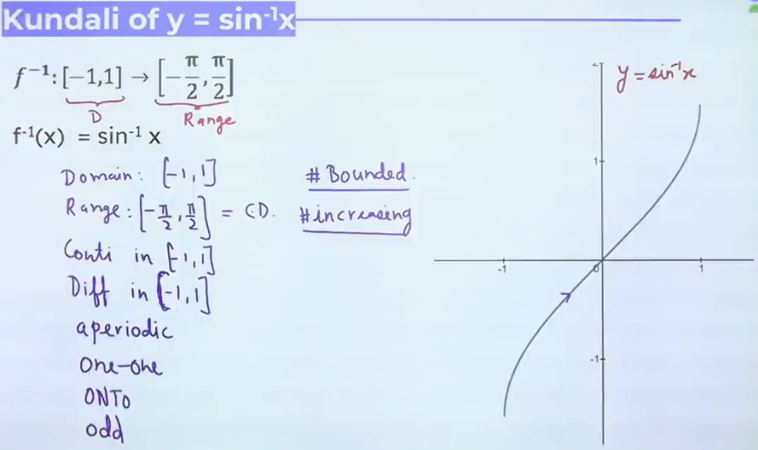
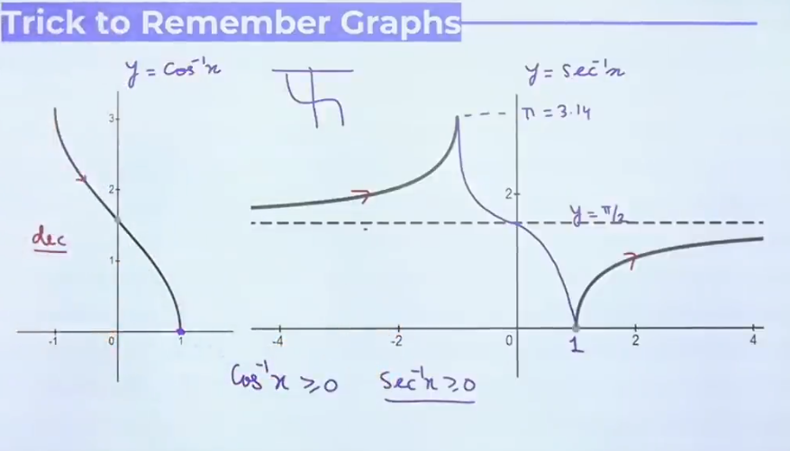
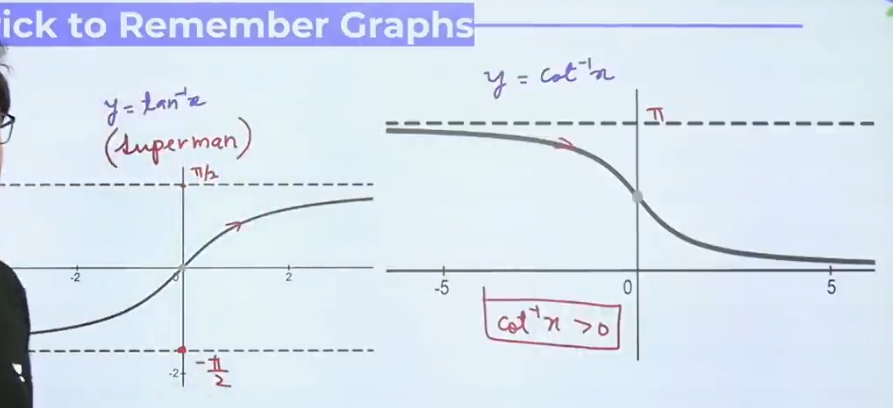
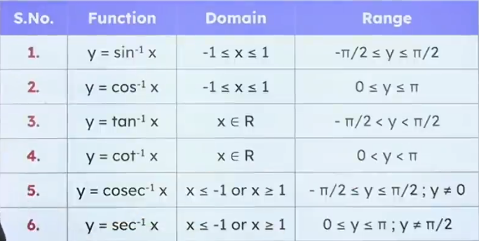

### $sine^{-1}x \ cosec^{-1}x \ Graph$

### $Cos^{-1}x \ Sec^{-1}x \ Graph$

### $tan^{-1}x \ cot^{-1}x \ Graph$

### Domain and Range

### Tips & Tricks :
- Wherever get a Inverse Trigonometric Function, put it equal to $\alpha , \beta, \gamma, \theta, \phi$ i.e., $ITF \to \alpha , \beta, \gamma, \theta, \phi$.
- Sign of ineqality changes in decreasing function i.e., $cos^{-1}x, cot^{-1}x, cosec^{-1}x$.

## Properties of ITF

### Property 1
1. $sin^{-1}(-x) = -sin^{-1}x$
2. $tan^{-1}(-x) = -tan^{-1}x$
3. $cosec^{-1}(-x) = -cosec^{-1}x$
4. $cos^{-1}(-x) = \pi - cos^{-1}x$
5. $cot^{-1}(-x) = \pi - cot^{-1}x$
6. $sec^{-1}(-x) = \pi - sec^{-1}x$

### Property 2
1. $sin(sin^{-1}x) = x, -1 \le x \le 1$
2. $cos(cos^{-1}x) = x, -1 \le x \le 1$
3. $tan(tan^{-1}x) = x, x\to R$
4. $cot(cot^{-1}x) = x,x\to R$
5. $sec(sec^{-1}x) = x, |x| \ge 1$
6. $cosec(cosec^{-1}x) = x,|x| \ge 1$

### Property 3
1. $sin^{-1}(sinx) = x, \ x \in [ - \frac \pi 2 , \frac \pi 2 ]$
2. $tan^{-1}(tanx) = x, \ x \in ( - \frac \pi 2 , \frac \pi 2 )$
3. $cosec^{-1}(cosecx) = x, \ x \in [ - \frac \pi 2 , \frac \pi 2 ] - {0}$
4. $cos^{-1}(cosx) = x, \ x \in [ 0, \pi ]$
5. $cot^{-1}(cotx) = x, \ x \in ( 0,\pi )$
6. $sec^{-1}(secx) = x, \ x \in [0,\pi] - {\frac \pi 2}$

### Property 4
1. $sin^{-1}x + cos^{-1}x = \frac \pi 2, \ -1 \le x \le 1$
2. $tan^{-1}x + cot^{-1}x = \frac \pi 2, \ x \in R$
3. $cosec^{-1}x + sec^{-1}x = \frac \pi 2, \ |x| \ge 1$

### Property 5
1. $sin^{-1}x = cosec^{-1} \frac 1 x ; \ |x| \le 1, \ x \ne 0$
2. $cos^{-1}x = sec^{-1} \frac 1 x ; \ |x| \le 1, \ x \ne 0$
3. $cosec^{-1}x = sin^{-1} \frac 1 x ; \ |x| \ge 1$
4. $sec^{-1}x = cos^{-1} \frac 1 x ; \ |x| \ge 1$
5. $cot^{-1}x = tan^{-1} \frac 1 x ; x > 0$
$\ \ \ \ \ \ \ \ \ \ \ \ = \pi tan^{-1} \frac 1 x; x < 0$$

### Property 6

- $tan^{-1}1 + tan^{-1}2 + tan^{-1}3 = \pi$
- $tan^{-1}1 + tan^{-1}\frac 1 2 + tan^{-1}\frac 1 3 = \frac \pi 2$

### Property 7

