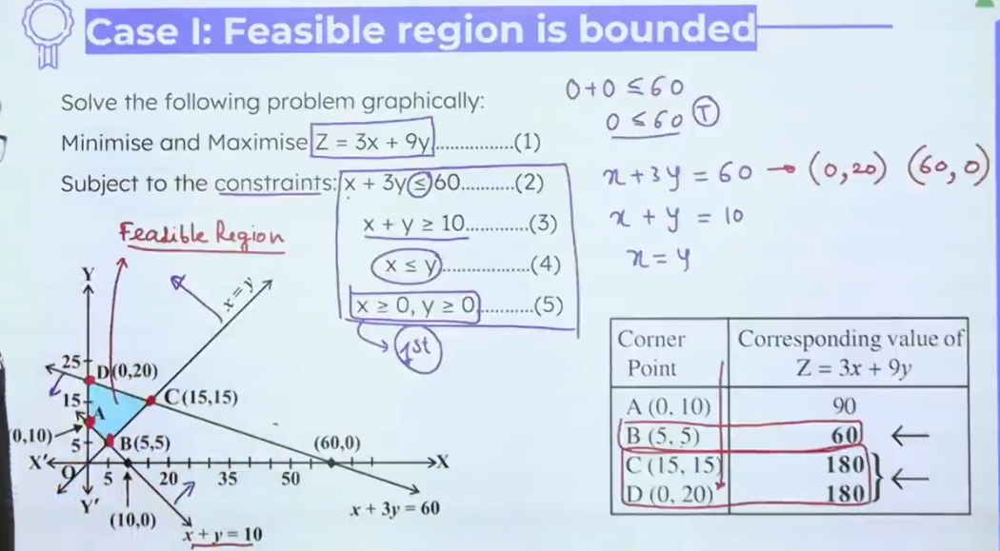
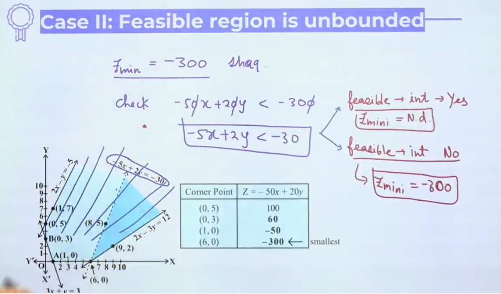

## Linear Programming
	One very special step of optimizing process

### Methods to solve Linear Programming Problems
	1. When feasible reason is bounded.
	2. When feasible reason is unbounded.

### Case I : Feasible reason is bounded

### Case II : Feasible reason is unbounded

