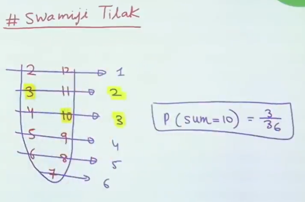
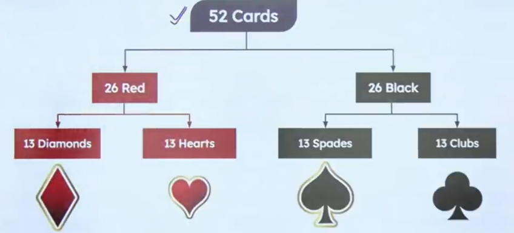
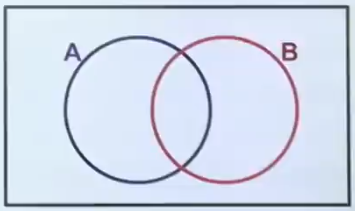
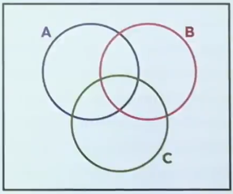
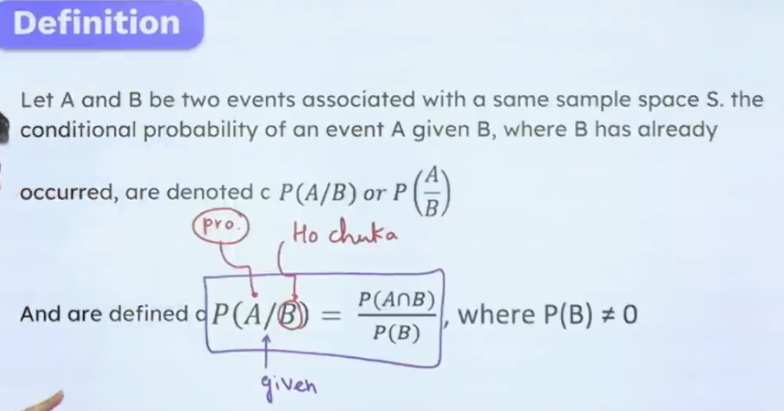
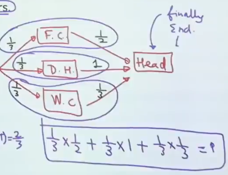
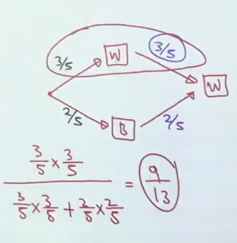
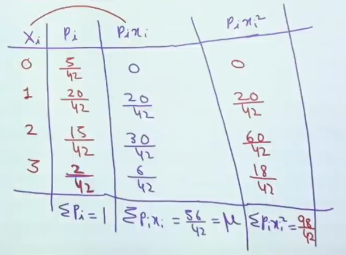

### Important Terms
##### Random Experiment :
	Experiment which satisfy the following conditions:-
	1. It should have more than one outcomes,
	2. Outcomes are not predictable.

##### Sample Space :
	It is a set of all possible outcomes of an random experiment. e.x.-
	1. Tossing of 1 Coin : S = {H, T}
	2. Tossing of 2 coins : S = {HH, TT, HT, TH}
- Represented by S.
- Number of elements in sample space = $2^n$

##### Events : 
	Events is a subset of sample space.
	Represented by capital alphabets.
	Ex - Getting out an odd number of outcome in throwing a dice :
	S = {1, 2, 3, 4, 5, 6}
	A = {1, 3, 5}

##### Complement of an Event : 
	The complement of an event 'A' with respect to a sample space S are the set of all elements of 'S' which are not in A.
- It is usually represented by $A', \bar A, or A^c$.
- $P(A) + P(\bar A) = 1$.

## Probability :

$$
P(A) = \frac{Number\ of\ favourable\ outcomes}{Total\ Number\ of\ out\ comes} \ \ \ \ \ \ \ \ \ \ \ \ 0 \le P(A) \le 1
$$

$$
Odd \ in \ favour \ of \ an \ event \ = \ \frac{Number \ of\ favourable\ cases}{Number\ of\ unfavourable\ cases}
$$

$$
Odds \ against \ in \ an \ events \ = \frac{Number \ of\ unfavourable\ cases}{Number\ of\ favourable \ cases}
$$

#### Double Dice Problem
##### Probability of getting sum                                 #trick 

#### Cards Problem

- `Face Card`s :- K, Q and J.
- `Honours Cards` :- A, K, Q and J.
- `Knave Cards` :- 10, J and Q.

## Types of Events :
##### Impossible and sure event :
	Impossible : Getting 7 on a trow of a single dice.
	Sure : Getting a number less than 7 on a throw of single dice.

##### Simple Event and Compound Event :
	Simple Events : Number of elements = 1, i.e., n(E) = 1.
	Compound Events : Number of elements > 1, i.e., n(E) > 1.

##### Equally Likely Events :
- Events are equally likely if they have same probability of occurrence.
- P(A) = P(B).
- `Getting odd outcome` and `getting even outcomes` in a single throw of a fair dice.
- `Getting head` and `Getting Tail` on the toss of a fain coin.

##### Mutully Exculsive OR Disjoint Events :
- Two events A and B are said to be mutually exclusive or disjoint if their simultaneous occurence is immpossible.
- If A and B mutually exclusive then $A \cap B = \phi$.
- RE - Tossing a fair coin.
- S - {H, T}
- A - {H},  B - {T}

##### Exhaustive Events :
- Events whose union are equal to sample space.
- If A, B  and C are exhausted then $A \cup B = S$
- Example - RE : Throwing a dice,       A : Getting odd outcome     B : Getting Even outcome.

##### Dependent and Independent Events :
- Two events A and B are independent if occurrence or non-occurrence of A has no effect on occurrence or non occurrence of B.
- A dice is thrown and a coin is tossed , then getting of even number  on dice and getting head on coin are `independent`.
- If rains then crop will be good are `dependent`.

## Addition theorem on probability :
If A and B are two events associated with  an experiment then,
1. $P(A \cup B)$ are probability of occurence of `at least on event`.
2. $P(A\cap B)$ are probability of occurence of `both A and B`.
3. $P(A)$ is probability of occurence of $A$.
4. $P(B)$ is probability of occurence of $B$.

1. $P(\ at\ least\ one\ event\ will\ occur\ ) = P(A \cup B) = P(A) + P(B) -P(A \cap B)$.
2. $P(\ exactly\ one\ event\ will\ occur\ )  = P(A) + P(B) -2P(A \cap B)$
3. $P(\ only \ A \ occurs) = P(A) - P(A \cap B)$
4. Note :- 
- If A and B are `mutually exclusive` events then $P(A \cup  B) = P(A) + P(B)$.
- If A and B are `exhaustive events` then $P(A \cup B) = 1$.

1. $P(\ at\ least\ one\ event\ will\ occur\ ) = P(A \cup B \cup C) = P(A) + P(B) + P(C) - P(A \cap B) - P(B \cap C) - P(A \cap C) + P(A \cap B \cap C)$
2. $P(\ exactly\ one\ event\ will\ occur\ )  = P(A \cap B) + P(B \cap C) + P(A \cap C) -3P(A \cap B \cap C)$
3. Note :- 
- If A and B and C are `mutually exclusive` events then $P(A \cup  B \cup C) = P(A) + P(B) +P(C)$.
- If A and B are `exhaustive events` then $P(A \cup B \cup C) = 1$.

## Conditional Probability

## Multiplication Theorem of Probability
$P(A \cap B) = P(A).P(B/A)$
- If A and B be two independent events, then $P(A / B) = P(A)$
- If A and B be two independent events, then $P(A \cap B) = P(A).P(B)$

### Infinite G.P. 
- $\frac{a}{1-r}$

#### Total Probability Theorem
- Used to find the end probability.
- Create Tree Diagram.
- Multiply the individual branches and add them up.
- Example:-
	

#### Bayes Theorem
- Used to find the middle probability.
- Create Tree Diagram.
- Multiply favourable branch and then divide it by total probability.
- Example:-
	

### Probability Distribution Table
- Mean :- $\mu = \sum p_i \ x_i$
- Variance :- $\sigma^2 = \big(\sum pi \ xi^2\big) - \mu^2$
- Stanard Deviation :- $\mu = \sqrt{variance}$

### Bernoulli Trials
Trials of random experiment are called Bernoulli trials if they satisfy the following conditions.
1. There should be finite no. of trials.
2. The trials should be independent.
3. Each trial has exactly two outcomes: success or failure.
4. The probability of success remains the same in each trials.
Bernoulli trial is denoted by B(n, p)
n $\to$ no. of times experiment performed.
p $\to$ probability of success.
q $\to$ probability of failure.
- Mean of BPD :- $np$
- variance of BPD :- $npq$
- Standard Deviation of BPD :- $\sqrt{variance} = \sqrt{npq}$

### Binomial Distribution Table :

### Binomial Probability
Let an experiment has n-independent trials, and each of the trial has two possible outcomes
1. Success
2. Failure
r $\to$ no. of success
n $\to$ no. of time experiment performed
p $\to$ probability of getting success.
q $\to$ probability of getting failure.
such that p + q = 1
$P(exactly\ r\ success) = P(X = r) = \ ^nC_r\ p^r\ r^{n-r}$
