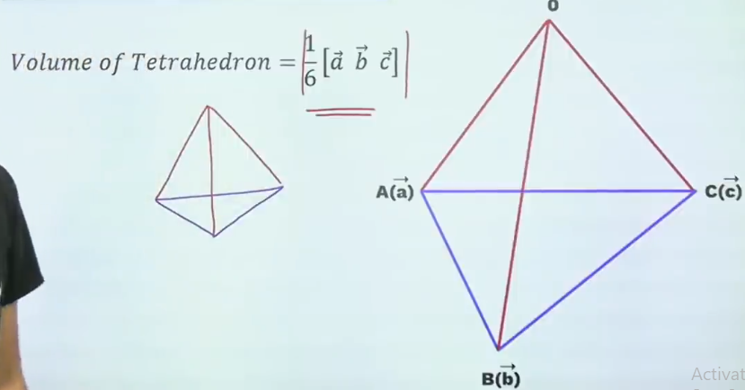

### Magnitude of Vector
- Represented by $|\vec{A}|$
- $|\vec{A}|= \sqrt{x^2 + y^2 + z^2}$

### Types of Vectors :

#### Zero or Null Vector :
- Magnitude = 0
- Direction = Any arbitrary direction

#### Unit Vector :
- Magnitude = 1
- Direction = 
- Unit vector in direction of $\vec a = \hat a = \frac{\vec a}{|\vec a|}$ 
- Unit vector in the direction of x axis = $\hat i$
- Unit vector in the direction of y axis = $\hat j$
- Unit vector in the direction of z axis = $\hat k$

#### Free Vector :
Vectors which can be shfted in a direction which is parrallel to itself.

#### Position Vector :

- The position vector of point p = $\vec{OP} = 2\hat{i} + \hat{j} + 3\hat{k}$

#### Collinear or Parallel Vector :

- If Two vectors are `parallel` they are `proportional`.
- If Three vectors are collinear then $a  = \lambda b$
- $\frac{a_1}{a_2} = \frac{b_1}{b_2} = \frac{c_1}{c_2} = \lambda$. #imp 

#### Coplanar Vectors :
- Vectors which are lying in the same place.
- Two vectors are always coplanar.
- Two or more vectors can not be colplaner

### Multiplication of vector by a scaler :
- $\vec a = x\hat i + y \hat j + z \hat  k$
- then, $k\vec a = (kx)\hat i + (ky)\hat j + (kz)\hat k$

### Properties of Vectors :
- $k(\vec a + \vec b) = k\vec a + k\vec b$
- $(k + l)\vec a = \vec k + \vec l$

### Dot Product :
Let $\vec a$ and $\vec b$ be two non-zero vectors and $\theta$ the angle between them then its scalar product is denoted as $\vec a . \vec b$ and is defined as
$\vec a . \vec b = |\vec a||\vec b|cos\theta$
- $\hat i . \hat i = \hat j . \hat j = \hat k . \hat k = 1$
- $\hat i . \hat j = \hat j . \hat k = \hat k . \hat i = 0$
- If $\vec a = a_1\hat i + a_2\hat j + a_3\hat k$ and $\hat b = b_1\hat i + b_2\hat j + b_3\hat k$  then $\hat a . \hat b = a_1b_1 + a_2b_2 + a_3b_3$

### Properties of Dot Product :
- $\vec a . \vec b = \vec b . \vec a$
- $\vec a.\vec a = |\vec a|^2$
- $\vec a.(\vec b . \vec c) = \vec a . \vec b + \vec a . \vec c$
- $-|\vec a| |\vec b|\le \vec a.\vec b \le |\vec a| |\vec b|$
- $\vec a.\vec b \begin{cases} + \to If \theta \in [0, \pi/2] \\ \theta \in (\pi/2, \pi] \\ \theta = \pi/2 \end{cases}$
- $\vec 0 . \vec a = 0$
- If $\vec a\perp\vec b$ then $\vec a.\vec a = 0$ but if $\vec a.\vec b = 0$ then either $\vec a$ = 0 or $\vec b = 0$ or $\theta = 90\degree$
- If $\vec b = \vec c$ then $\vec a.\vec b = \vec a.\vec c$ but if $\vec a.\vec b = \vec a.\vec c$ then $\vec a = 0$ or $\vec b = \vec c$ or $\vec a \perp (\vec b - \vec c)$
- Identities
	- $(\vec a + \vec b)^2 = |\vec a|^2 + 2\vec a\vec b +|\vec b|^2$
	- $(\vec a + \vec b)^2 = |\vec a|^2 - 2\vec a\vec b +|\vec b|^2$
	- $(\vec a + \vec b)(\vec a - \vec b) = |\vec a|^2 - |\vec b|^2$
	- $|\vec a + \vec b| = |\vec a| + |\vec b| \to a\ || \ b$
	- $|\vec a + \vec b|^2 = |\vec a|^2 + |\vec b|^2 \to a\ \perp \ b$
	- $|\vec a + \vec b| = |\vec a - \vec b| \to \vec a \perp \vec b$

### Projection of Vector
- Projection of $\vec a \ on \ \vec b = \frac{\vec a.\vec b}{|\vec b|}$

### Linear Combination of vectors :
A vector $\vec r$ is said to be linear combination of the vectors $\vec a, \vec b, \vec c, ...$.
If scalers x, y, z, ... Such that $\vec r = x \vec a + y\vec b + z\vec c + ...$

#### Theorm in Plane : 
If three non-zero, non-collinear vectors are `lying in the same plane` then any one vector can be represented as `linear combination of other two`.

## Cross Product or Vector Product :
- $\vec a X \vec b = |\vec a||\vec b|sin\theta \ \hat n$.
- $\hat n$ is the direction of the vector and is calculated by `right hand thappad rule`.

#### Properties of Vector Product :
- $\vec a X \vec b \neq \vec b X \vec a$. In fact, $\vec a X \vec b = -\vec b X \vec a$.
- For scaler m, $m\vec a X \vec b = m(\vec a X \vec b) = \vec a X m\vec b$
- $\vec a X (\vec b \pm \vec c) = \vec a X \vec b \pm \vec aX\vec c$
- If $\vec a || \vec b$ then $\theta = 0 or \pi\ \Longrightarrow \vec a X \vec b = 0$ (but $\vec a X \vec b = 0 \Longrightarrow \vec a = 0 \ or \ \vec b = 0 \ or\ \vec a || \vec b$). In particular $\vec a X \vec a = 0$.
- If $\vec a \perp \vec b$ then $\vec a X \vec b = |\vec a|\ |\vec b|\ \hat n$ (or $\vec a X \vec b = |\vec a| \ |\vec b|$)
- 
- 
- 
- 

## Geometric Interpretaion of Cross Product
### Area of Parallelogram :
1.  If two adjacent sides are given :- $|\vec A X \vec B|$
2. If diagonals are given :- $\frac 1 2 |\vec d_1 X \vec d_2|$
3. If position vectors of vertex are given :-

### Area of Triangle : $\frac 1 2 \ Area \ of \ Parallelogram$

### Area of Quadrilateral : $A = \frac 1 2 |d_1 X d_2|$

### Collinearity of thre Points
Three pounts are collinear if $ar(ABC) = 0 \ or\ \vec AB \ ||\ \vec BC \ || \ \vec CA$

## Scaler Triple Product / Box Product
$\vec a.(\vec b X \vec c) = [\vec a \ \vec b \ \vec c]$ 
If $\vec  a = a_ik + a_2j + a_3 k, \ \vec b = b_1i+ b_2j+v_3k, \ \vec c = c_1i + c_2j + c_3k$ , then 

$$
[\vec a \ \vec b \ \vec c ] = \begin{bmatrix} a_1 & a_2 & a_3 \\ b_1 & b_2 & b_3 \\ c_1 & c_2 & c_3 \end{bmatrix}
$$

### Goemetric Interpellation of Box Product :
#### Volume of Parallelepiped :

#### Volume of Tetrahedron

### Properties of Box Product :
1. The position of (.) and (x) can be interchanged i.e. $\vec a . (\vec b \ x \ \vec c) = (\vec a \ x \ \vec b).\vec c$
2. $[\vec a \ \vec b \ \vec c] = -[\vec a \ \vec c \ \vec b]$
3. $[\vec a \ \vec b \ \vec c] = [\vec c \ \vec a \ \vec b] = [\vec b \ \vec c \ \vec a]$ in cyclic order only
4. $[\vec a\ \vec b \ \vec b] = [\vec b \ \vec a \ \vec b] = 0$
5. The scaler triplet product of  three `mutual perpendicular unit vectors` is $\pm$ 1. Thus, $[\vec{\hat i}\ \vec{\hat j} \ \vec{\hat k}] = 1, \  [\vec{\hat i}\ \vec{\hat k} \ \vec{\hat j}] = -1$ 
6. If any two of the three vectors are paralllel. Then, $[\vec a \ \vec b \ \vec c] = 0$
7. Three non-zero non-collinear vectors are `coplaner` if $[\vec a \ \vec b \ \vec c] = 0$ and vice versa.
8. $[\vec a \ \vec c \ \vec d] + [\vec b \ \vec c \ \vec d] = [\vec a+\vec b \ \ \  \vec c \ \vec d]$
9. $[\vec a + \vec b \ \ \vec b+ \vec c  \ \ \vec c + \vec a] = 2[\vec a \ \vec b \ \vec c]$
10. $[\vec a - \vec b \ \ \vec b - \vec c  \ \ \vec c - \vec a] = 0$
11. $[\vec a X \vec b \ \ \vec bX \vec c  \ \ \vec c X\vec a] = [\vec a \ \vec b \ \vec c]^2$

### Linearly Dependent v/s Independent Vectors :
##### For 2 non zero vectors :
- Linearly Dependent : $\vec a \parallel \vec b$
- Linearly Independent : $\vec a \nparallel \vec b$

##### For 2 non zero vectors :
- Linearly Dependent : $[\vec a \ \vec b \ \vec c] = 0$
- Linearly Independent : $[\vec a \ \vec b \ \vec c] \neq 0$

## DCs & DRs

#imp
![[Pasted image 20230526121959.png]]