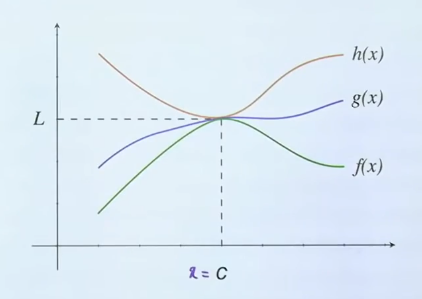
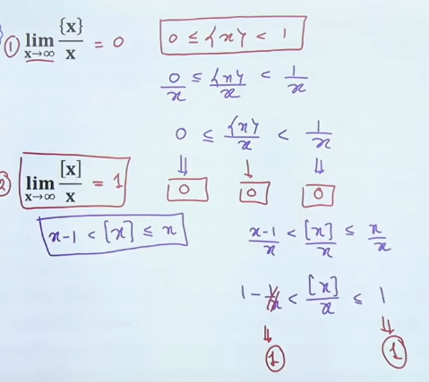

# Limits
It is a tendency of a function towards a number.
- $x\to0$ is a 'tends to' symbol, means $x \neq 0$ but somewhere the value of x is very close to 0 ie., 0.00001 or -0.000001 

###### Example:
$f(x) = x + 3$

$$
\begin{flalign}
&\lim_{x\to3} f(x)&&
\end{flalign}
$$

$x = 3.000000001 \ OR \ x = 2.99999999$
$f(x )= 6.000000001 \ OR \ f(x) = 5.99999999f(x)$

$$
\begin{flalign}
&\lim_{x\to3} f(x) = 6&&
\end{flalign}
$$

## Existence of Limit
If **LHL = RHL = Finite** then limit exists

# Indeterminate Form

$$\frac 0  0, \ \frac \infty \infty, \ \infty-\infty, \ \infty^0, \ 0^0, \ 1^\infty, \ 0*\infty$$

### Solving $\frac 0 0, \ \frac \infty \infty$ Form
1. Factorization
2. Rationalization (For root $f^n$)
3. L'Hopital Rule (By Deferentiating $f^n$)

### $\lim_{x\to\infty}, \  \lim_{x\to-\infty}$
- Put $x = \frac 1 t$        $x \to \infty$
- Put $x = \frac {-1} {t}$      $x \to -\infty$
- $\because x \to \infty$
- $\therefore t \to 0$

### Solving $0 * \infty, \ \infty * \infty$ Form
- Convert to $\frac 0 0, \ or \ \frac \infty \infty$ by putting $x = 1/t$
- Use factorization/ rationalization / L'Hopital.

### Squeeze or Sandwich Theorem
If $f(x)\leq g(x)\leq h(x)$ and $\lim_{x \to c} f(x) = L$ and $\lim_{x \to c} h(x) = L$ them **$\lim_{x \to c} f(x) = L$**

### Standard Forms
 $$
\begin{flalign}
&\lim_{x\to0} \frac{ln(1+x)}{x} = 1&&
\end{flalign}
$$

$$
\begin{flalign}
&\lim_{x\to0} \frac{a^x -1}{x} = lna&&
\end{flalign}
$$

$$
\begin{flalign}
&\lim_{x\to0} \frac{e^x -1}{x} = 1&&
\end{flalign}
$$

$$
\begin{flalign}
&\lim_{x\to0} \frac{1-\cos x}{x^2} = \frac 1 2&&
\end{flalign}
$$

$$
\begin{flalign}
&\lim_{x\to0} \frac {sinx} x = \lim_{x\to0} \frac x {sinx} = 1&&
\end{flalign}
$$

$$
\begin{flalign}
&\lim_{x\to0} \frac {tanx} x = \lim_{x\to0} \frac x {tanx} = 1&&
\end{flalign}
$$

$$
\begin{flalign}
&\lim_{x\to0} \frac {sin^-1x} x = \lim_{x\to0} \frac x {sin^-1x}= 1&&
\end{flalign}
$$

$$
\begin{flalign}
&\lim_{x\to0} \frac {tan^-1x} x = \lim_{x\to0} \frac x {tan^-1x} = 1&&
\end{flalign}
$$

### Solving $0^0, \infty^0$ Forms
- Take $\log_e$ on both side.
