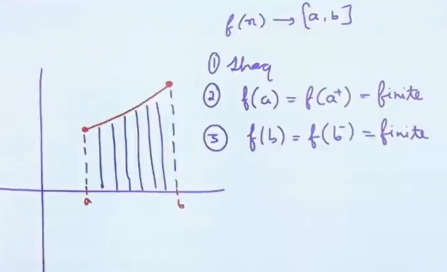
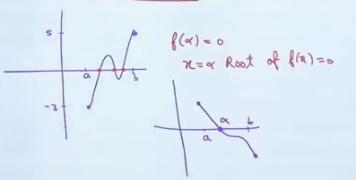

# Continuous Function
Any function $f(x)$ is said to be continuous if we draw the graph of that function **without lifting the function**.

# Continuity at a point
A function $f(x)$ is said to be continuous at $x = a$, if

$$
\begin{flalign}
&\lim_{x\to a}f(x) = f(a) = Finite&&
\end{flalign}
$$

## 3 Important Points to Remember

#### 1. Continuity is always talked in the domain of the function.
$\Longrightarrow f(x) = \frac  {1}{1-x}, \frac 1 x$ are all continuous function **in its domain**.
$\Longrightarrow \frac 1 {1-x}$ is discontinuous at $x = 1, \frac 1 x$ is discontinuous at $x=0$.

#### 2. Point functions are continuous.
E.g. $\sqrt{1-x}+\sqrt{x-1}, \sqrt x + \sqrt{-x}$

#### 3. Inverse of Discontinuous function can not be continuous

## 3 Reason of Discontinuity

$$\begin{flalign}
&\lim_{x\to a} f(x) \ does\ not \ exist&
\end{flalign}$$

Examples:
- $f(x) = [x]$
- $f(x) = \frac{x}{x-1}$

$$\begin{flalign}
&\lim_{x\to a} f(x)\ exists\ but\ is\ not\ equal\ to\ f(a)&
\end{flalign}$$

$$\begin{flalign}
&f(x) = \begin{cases}(1-x)tan\frac{\pi x}{2} &\text if\ x \neq 1 \\ \frac \pi 2 &\text if\ x = 1\end{cases}&
\end{flalign}$$

3. $f(a)$ is not defined
- $f(x) = \frac x {x-1}$

### Note
1. Every polynomial function is continuous.
2. Every rational function is continuous at every points where its denominator is not equal to zero.
3. Logarithmic function, Exponential function, Trigonometric function, Inverse Circular function, and Modulus function are continuous in its domain.

## Continuity in an interval
#### Continuity in open interval
A function $f$ is said to be continuous in (a,b) if f is continuous at each and every point in (a,b).

#### Continuity in closed interval
A function f is said to be continuous in a closed interval $[a,b]$ if
1. f is continuous at each and every point in (a,b).
2. f is right continuous at 'a' i.e. $\lim_{x\to a^+} f(x) = f(a)$ = finite number.
3. f is left continuous at 'a' i.e. $\lim_{x\to b^-} f(x) = f(b)$ = finite number.

#### Possible Points of Discontinuity(P.P.O.D.)
1. All Polynomials, Trigonometric functions, Exponential and Logarithmic functions are continuous at their domain.
2. Continuity of $\{f(x)\}$ and $[fx(x)]$ at all points where  $f(x)$ becomes integer.
3. Continuity of a function should be checked at the points where definition of the function changes.
4. Continuity of a point should be checked at end points.

### Theorems on Continuity
#### Theorem 1: Super Table
| $f(x)$        | $g(x)$        | $f(x)\pm g(x)$    | $f(x).g(x)\ or\ f(x)/g(x)$ |
| ------------- | ------------- | ----------------- | -------------------------- |
| Continuous    | Continuous    | Continuous        | Continuous                 |
| Continuous    | Discontinuous | Discontinuous     | May be Continuous          |
| Discontinuous | Discontinuous | May be Continuous | May be Continuous          | 

#### Theorm 2: Intermediate Value Theorem (IVT)
If $f$ is continuous on $[a, b]$ and $f(a) \neq f(b)$
Then for any value $c \in (f(a),f(b))$, there is at least one number $x_0$ in $(a, b)$ for which $f(x_0) = c$

##### Application of Intermediate Theorem
If $f(x)$ is continuous on $[a, b]$ and $f(a).f(b)<0$
Then there exists at aleast one root of $f(x)$ in $(a, b)$

#### Theorem 3: Extereme Value Theorem
If $f$ is continuous on $[a,b]$
then $f$ takes on, a least value of m and a greatest value M on this interval

### Continutity of function tending to infinity

$$\begin{flalign}&Remember,\ \lim_{x\to\infty} a^n=\begin{cases}0 & 0\leq a < 1 \\ 1 & a=1 \\ \infty & a > 1 \end{cases} &\end{flalign}$$

### Shortcut when $x\in R\text{ and } x\notin R$

$$\begin{flalign}&f(x) = \begin{cases} x & \text{if x is rational}\\ 1-x &\text{if x is irrational}&\end{cases}&\end{flalign}$$

This function is continuous only at $x=1-x$ i.e.
$Discontinuous\ \forall x \in R - \frac 1 2$ 

### Continuity of Composition Function
Continuity.png)
Continuity.png)

