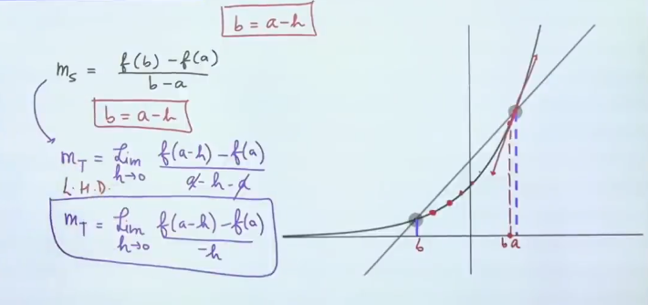

# Derivability/Differentiability
### Physical Meaning:
Instantaneous rate of change of function.
### Geometrical Meaning:
- Slope of the tanget drawn to a curve at $x=a$, if it exists
- a $f^n$ is said to be **differentiable** at x = a if **unique tangent** exist.

$$\begin{flalign}&R.H.D.=f'(a^+)=\lim_{h\to 0}\frac{f(a+h)-f(a)}{h}&\end{flalign}$$

$$\begin{flalign}&L.H.D.=f'(a^-)=\lim_{h\to 0}\frac{f(a-h)-f(a)}{-h}&\end{flalign}$$

## Existence of Derivative
**L.H.D. = R.H.D. = Finite** 

#### Reasons of Non-Derivability
1. SharpCorner
2. $f^n$ is discontinious
3. Vertical Tangent

# Derivability over an open/close interval
