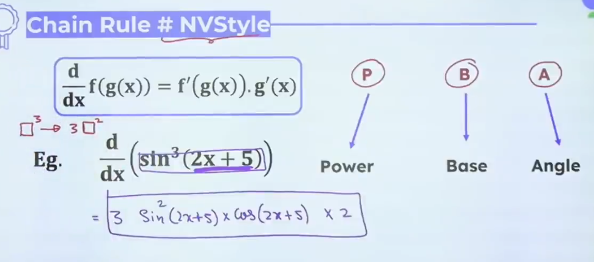
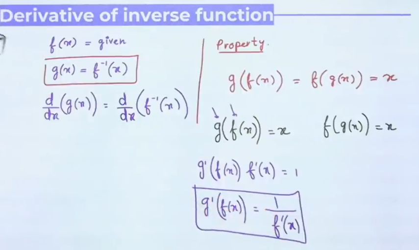

# Standard Derivatives
| y of $f(x)$      | $\frac{dy}{dx}$ or $f'(x)$                        |
| ---------------- | ------------------------------------------------- |
| K, K is constant | $\frac{dy}{dx} (K)$ = 0                           |
| $X^n$            | $\frac{dy}{dx} (X^n) = nX^{n-1}$                  |
| $\sqrt x$        | $\frac{dy}{dx} (\sqrt{X}) = \frac {1}{2\sqrt{x}}$ |
| $e^x$            | $\frac{dy}{dx} (e^x) = e^x$                       |
| $a^x$, a>0         | $\frac{dy}{dx} (a^x) = a^x\log a$                 |
| sin x            | $\frac{dy}{dx} (sin\ x) = sin\ x$                 |
| cos x            | $\frac{dy}{dx} (cos\ x) = -sin\  x$               |
| tan x            | $\frac{dy}{dx} (tan\ x) = sec^{2}\ x$             |
| cot x            | $\frac{dy}{dx} (cot\ x)=-cosec^2\ x$              |
| sec x            | $\frac{dy}{dx} (cosec\ x)=sec\ x\tan x$          |
| cosec x          | $\frac{dy}{dx} (cosec\ x)=-cosec\ x\cot x$        |
| $sin^{-1} x$     | $\frac{dy}{dx} (sin^{-1}x)=\frac{1}{\sqrt{1-x^2}}$                          |
| $cos^{-1} x$     | $\frac{dy}{dx} (cos^{-1}x)=\frac{-1}{\sqrt{1-x^2}}$                         |
| $tan^{-1} x$     | $\frac{dy}{dx} (tan^{-1}x)=\frac{1}{1+x^2}$                                 |
| $cot^{-1} x$     | $\frac{dy}{dx} (cot^{-1}x)=\frac{-1}{1+x^2}$                                |
| $sec^{-1} x$                | $\frac{dy}{dx} (sec^{-1}x)=x\ \frac{1}{\sqrt{x^2-1}}$                                                   |

# Algebra of Differentiation
$\frac d{dx}(f(x)\pm g(x))=\frac d{dx}(f(x))\pm \frac d{dx}(g(x))$
$\frac d{dx}(f\ f(x)) = k\ \frac d{dx}(f(x))$
$(u*v)' = u*v'+u'*v$
$(u*v*w)' = u*v*w'+u*v'*w+u'*v*w$
$\frac{d}{dx}(\frac u v) = \frac{u'v - uv'}{v^2}$

# Chain Rule

#tip First Simplify and then differentiate
# Logarithmic Differentiation
Take log on both side if equation look like:
$y = f_1(x)f_2(x)f_3(x)...$   OR $y = (f(x))^{g(x)}$

# Derivative of Implicit Function

$$\begin{flalign}&\frac{dy}{dx} = \frac{-(\frac{dy}{dx})}{\frac{dx}{dy}}&\end{flalign}$$

#note The value of $\frac{dy}{dx}$ of any of homogeneous equation is equals to $\frac x y$
Example: $2x^3+55x^2y+2022xy^2+y^3=0 \Longrightarrow \frac x y$

# Derivative of Inverse Function

# Standard Substitution
| Expressions      | Substitution                       |
| ---------------- | ---------------------------------- |
| $\sqrt{a^2-x^2}$ | x = asin$\theta$ or acos$\theta$   |
| $\sqrt{a^2+x^2}$ | x = tan$\theta$ or acot$\theta$    |
| $\sqrt{x^2-a^2}$ | x = asec$\theta$ or acosec$\theta$ |
| $\sqrt{\frac{a+x}{a-x}}$ or $\sqrt{\frac{a-x}{a+x}}$                 | x = acos$\theta$ or acos2$\theta$|

# Parametric Differentiation

$$\begin{flalign} & x = f(t) & \\ & y = f(t) & \\ & \text{For single derivative } & \\ & \Longrightarrow  \frac{dy}{dx} = \frac{\frac{dy}{dt}}{\frac{dx}{dt}} & \\ &\text{For double derivative }& \\ & \Longrightarrow \frac{d^2y}{dx^2} = \frac{d}{dx}(\frac{dy}{dx})=\frac{d}{dt}(\frac{dy}{dx})\frac{dt}{dx}&\end{flalign}$$

# Differentiation of one $f^n$ w.r.t. to other function 

$$\begin{flalign}& \frac{d\ f(x)}{d\ g(x)}= \frac{\frac{d\ f(x)}{dx}}{\frac{d\ g(x)}{dx}} = \frac{f'(x)}{g'(x)} &\end{flalign}$$

# Successive Differentiation

$$
\begin{flalign} 
& y'=\frac{dy}{dx}=y_1=D_1(y)=f'(x) & \\
& y'' = \frac{d^2y}{dx^2}=y_2=D_2(y)=f''(x) & \\
& \frac{dx}{dy} = \frac{1}{\frac{dx}{dy}} & \\
& \frac{d^2y}{dx^2}=\frac{d}{dy}(\frac{dy}{dx}) & \\
& \frac{dx^2}{d^2y}\neq \frac{1}{\frac{d^2y}{dx^2}}= \frac{d}{dy}(\frac{dx}{dy}) &
\end{flalign} $$
