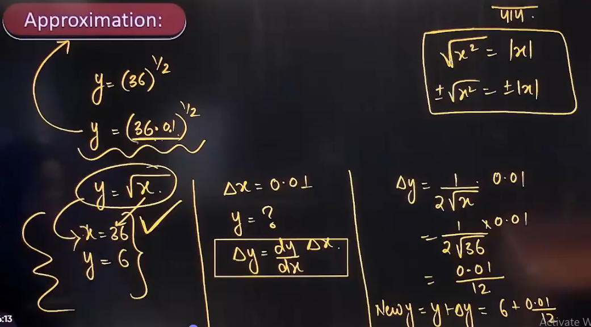
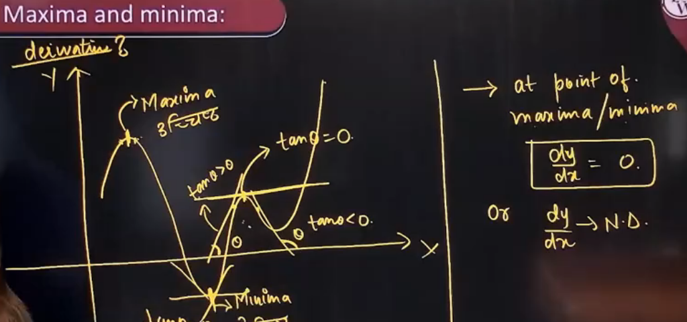
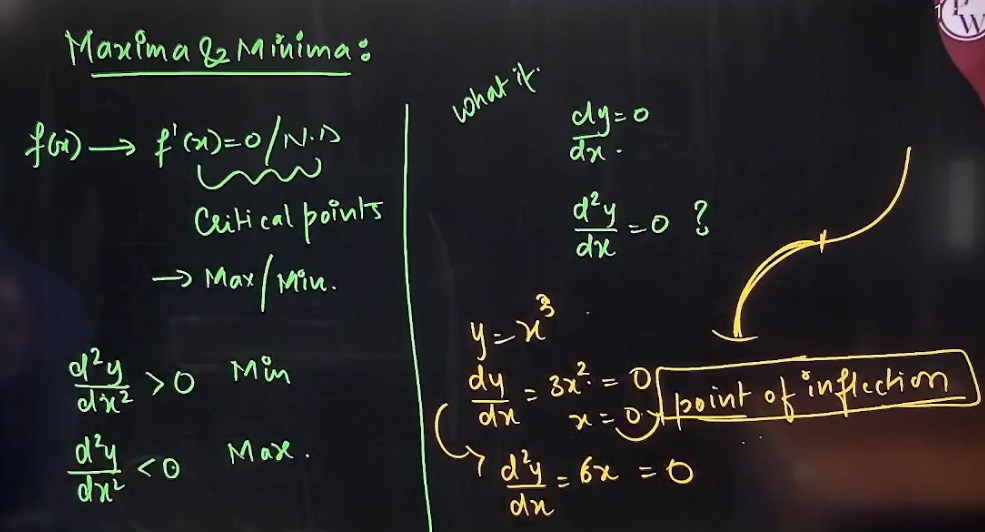

# 1. Rate of Change
- Differentiate function w.r.t. to time

# 2. Monotonicity
- $f(x)$ is increasing-
	- if $x_1 > x_2$
	- then, $f(x_1)>f(x_2)$
	- $\frac{dy}{dx}<0$
- $f(x)$ is decreasing-
	- if $x_1 > x_2$
	- then, $f(x_1)<f(x_2)$
	- $\frac{dy}{dx}>0$

- Strictly(Monotonicity) Increasing-
	- $\frac{dy}{dx}\geq0$      $[always]$
	- equlity holds at a single point only.
- Strictly(Monotonicity) Decreasing-
	- $\frac{dy}{dx}\leq0$      $[always]$
	- equlity holds at a single point only.

# 3. Tangent and Normal
- Slope of tangent = $\frac{dy}{dx}$
- Line exists on a point if -
	- 2 points given
	- 1 slope and 1 point is given
		- $(y_1-y)=m(x_1-x)$

- Tangent Equation-
	- $(y_1-y)=\frac{dy}{dx}|_{x_1,y_1}(x_1-x)$
- Normal Equation-
	- $(y_1-y)=\frac{-1}{\frac{dy}{dx}}|_{x_1,y_1}(x_1-x)$

- Facts about tangent slope-
1. Slope = 0
	- lines are parallel ||
	- y = k
2. Slope = $\infty$
	- Lines are perpendicular
	- angle = $90\degree$
	- x=k
3. $ax+by+c = 0$
	- Slope = $\frac{-a}{b}$
4. Two lines ahaving slope $m_1$ and $m_2$ will have relation $m_1 = \frac{-1}{m_2}$
5. Product of two perpendicular curve = -1.

- Angle b/w two curves.

# Aggregation

# Maxima and Minima

