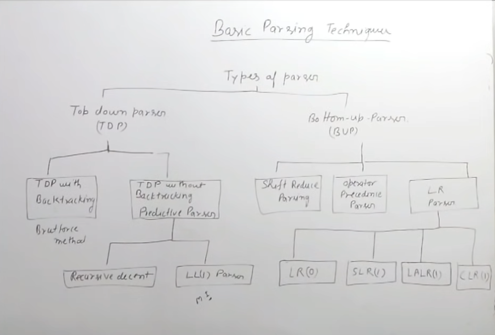
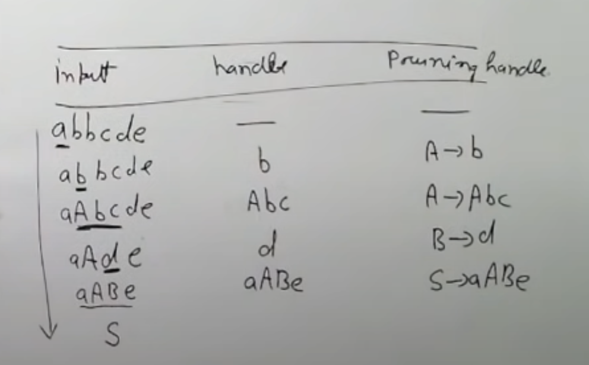
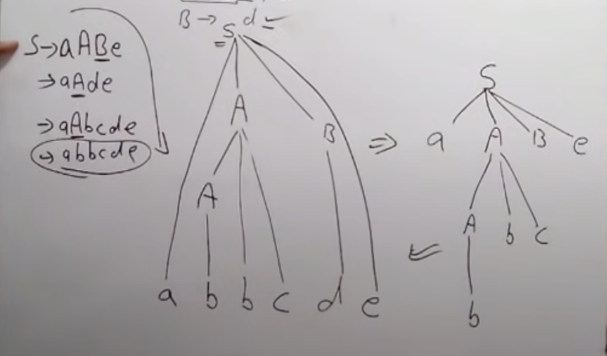
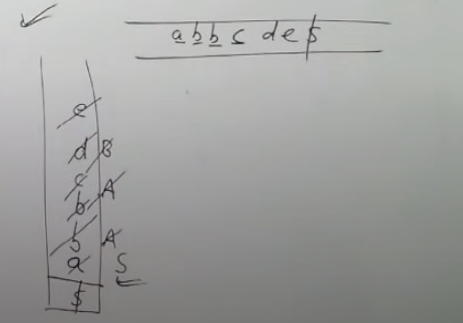
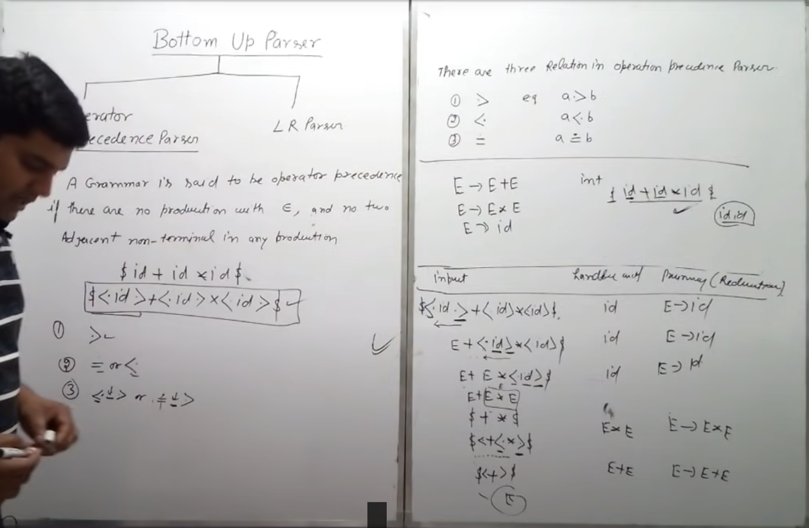

# Parsers

Parser generates parse tree corrosponding to any input string.



**Variants of Grammar**:

| Variants of Grammar | Top Down Parser | Bottom Up Parser |
|--|--|--|
| Ambiguous Grammar | ✔ | x |
| UnAmbiguous Grammar | ✔ | ✔ |
| left Recursive Grammar | x | ✔ |
| Right Recursive Grammar | ✔ | ✔ |
| Non Deterministic Grammar | x | ✔ |
| Deterministic Grammar | ✔ | ✔ |

## Top Down Parser

The parse tree is constructed from top to bottom, that is from root to leaves is called **Top Down Parser**.

- No: **Non Deterministic Grammar(no common prefix in grammar)** and no **Left Recursive Grammar**.

### LL(1) Parser

- **L** - Scan input from **Left to Right**.
- **L** - Left Most Derivation is used.
- **1** - Only one symbol is parsed at a time.


-Parser.png)

-Parser-example.png)

## Bottom Up Parser

The parse tree is constructed from bottom to up, that is from leaves to root is called **Bottom Up Parser**.

### Basic Terminology of Bottom up Parsing

Consider a example:

```pseudo
S -> aABc
A -> Abc/b
B -> d
```

1. **Handle and Handle Pruning**:

    

2. **Right Most Derivation Tree in Reverse**:

    

3. **Shift Reduce Parsing**:

    

### Operator Precedence Parsing



### LR(0) Parser

-example.png)

-example-1.png)

### SLR(1) Parser

- The only difference b/w LR(0) and SLR(1) is that we have to find the follow of the non-terminal(variable) at the level when the dot came at end.
- If after finding follow, then also if there is a S-R conflict, then given productions are in format of SLR(1) parser.
- Reduce entry in table is filled in column that are in Follow set of Left Hand side symbol of its related production.

Remember: **LR(1)** LR(1) items = LR(0) items + Look Ahead Symbols.

### CLR(1)

1. Auguemented Grammar.
2. In auguemented Grammar on RHS, there will be also Look Ahead Symbol.
    - In closure -> LAS will be the `First()` of the remaining suffix non-terminal symbols.
    - LAS can change when finding closure but will remain same on goto operation.
3. Reduce entry is to be filled on the basis of the Look Ahead Symbol.

### LALR(1)

- It is minimized form of `CALR(1)`.
- Minimizes states in which `LR(0)` items are same but Look Ahead Symbols are different.
- Merge those Items $I_{i}$ whose LR(0) items are same but Look Ahead Symbols are same.

### Comparison
![[parser-comparision.png]]