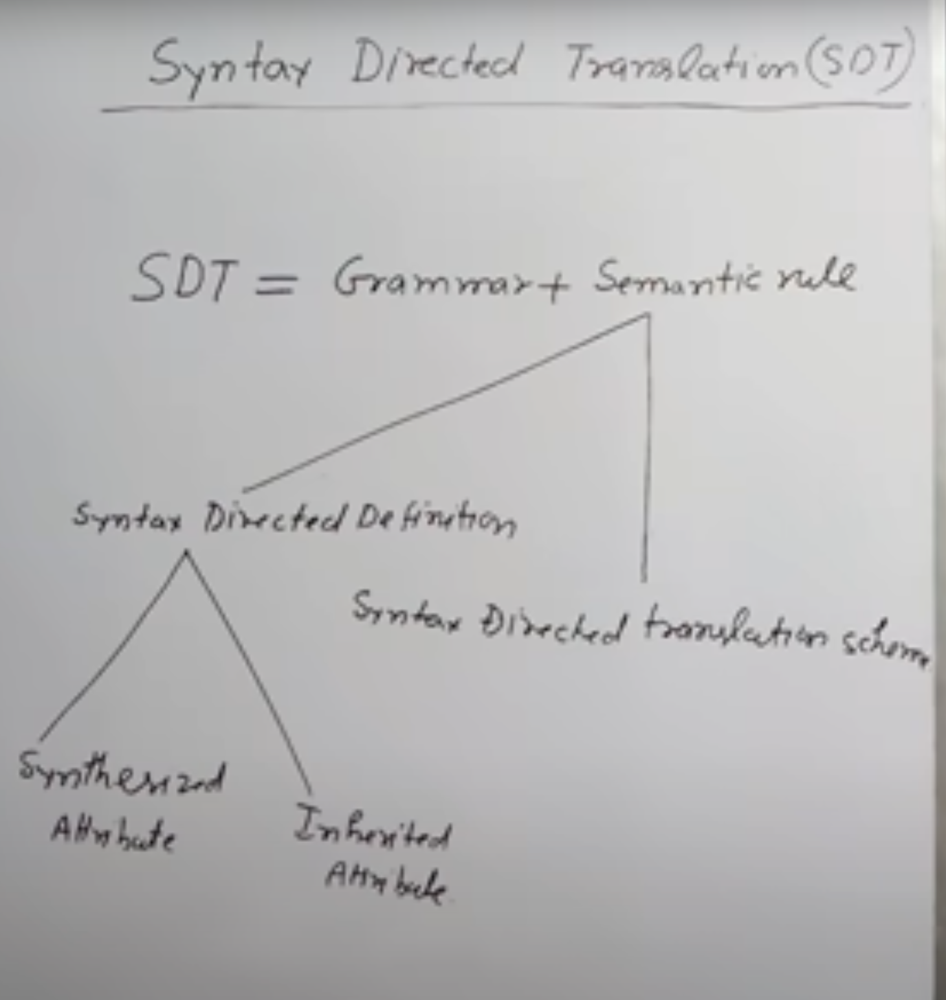
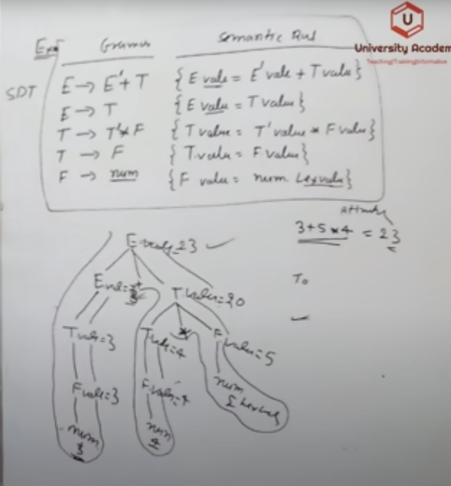
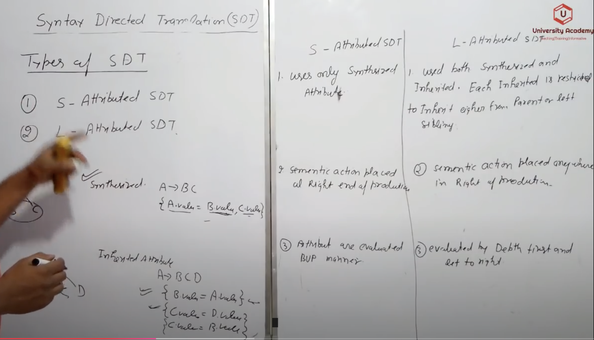
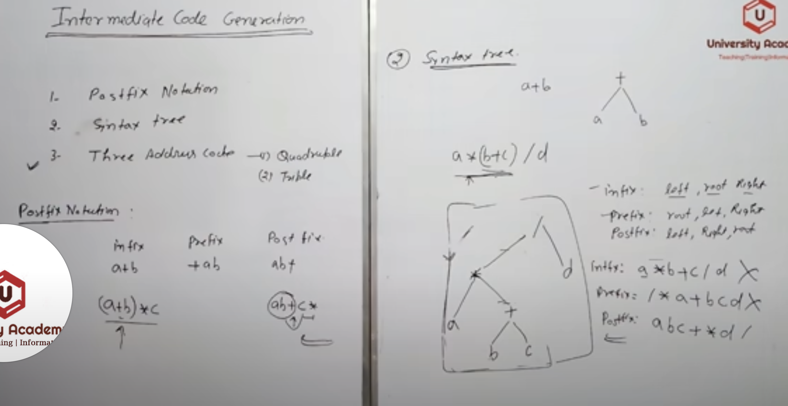
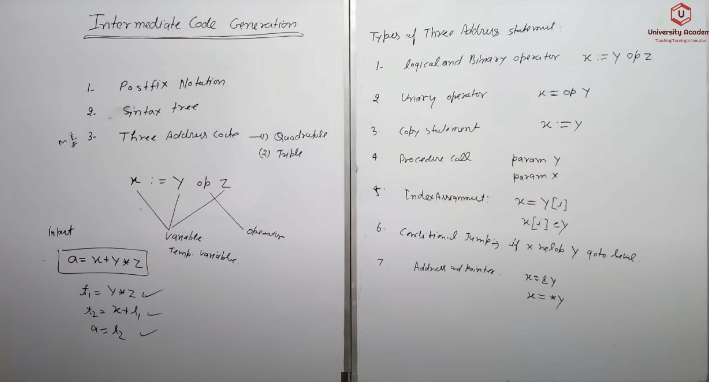
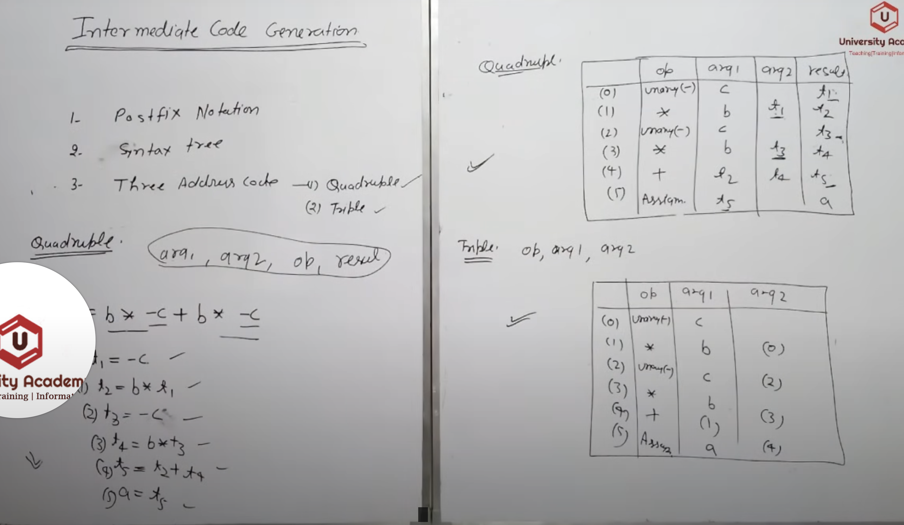
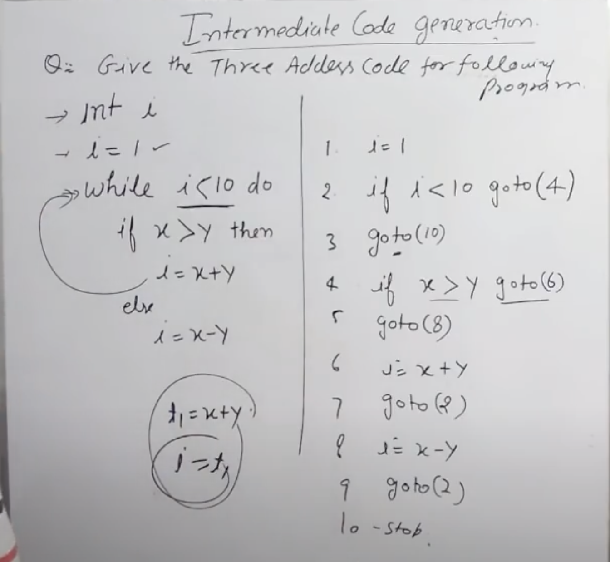
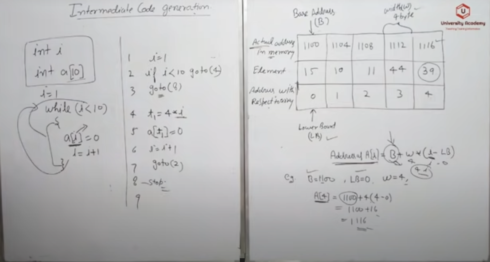
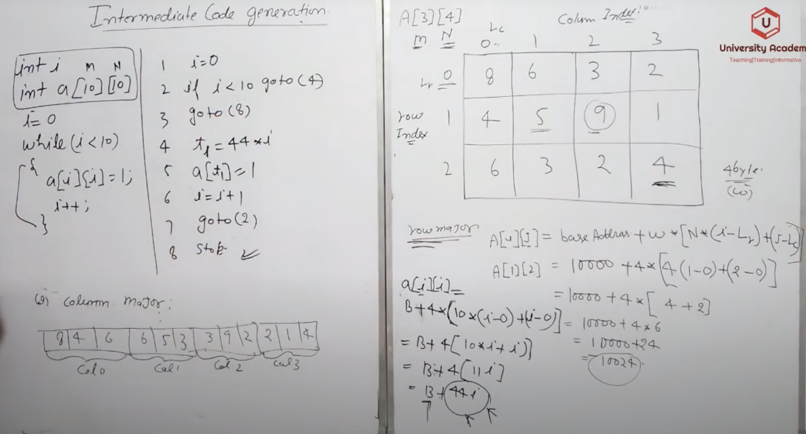
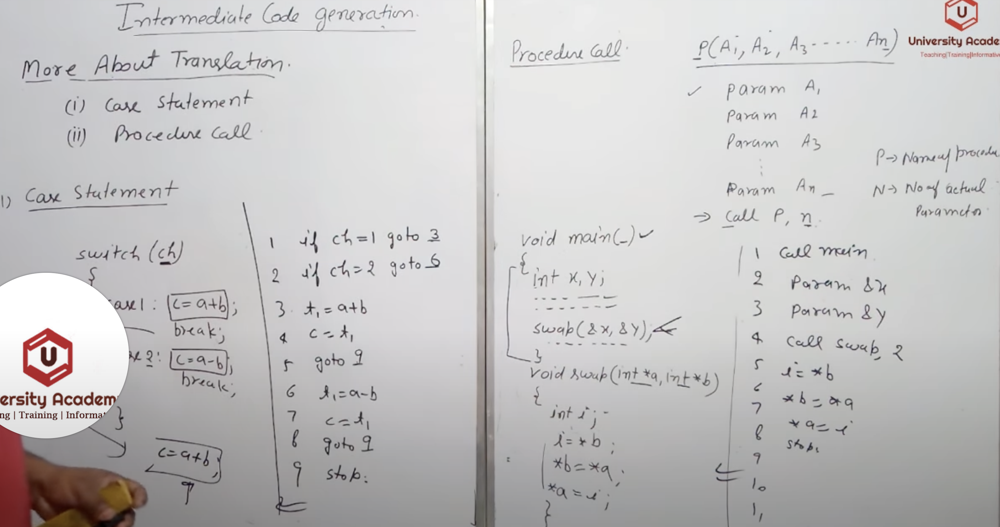

# Syntax Directed Tree

## Types of SDT

## Intermediate Code Generation
- It takes output of symantic analysis phase as input and return Three Address Code in response.
- Intermediate Codes can be generated by 3 parts:
	1. Postfix Notation
	2. Syntax Tree
	3. Three Address Code 
		1. Quadruple
		2. Triple

### Three Address Code

