# Symbol Table

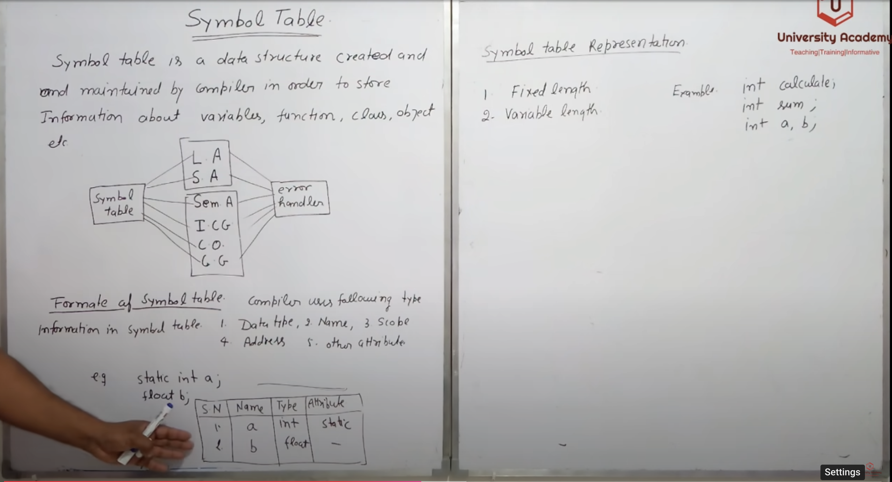

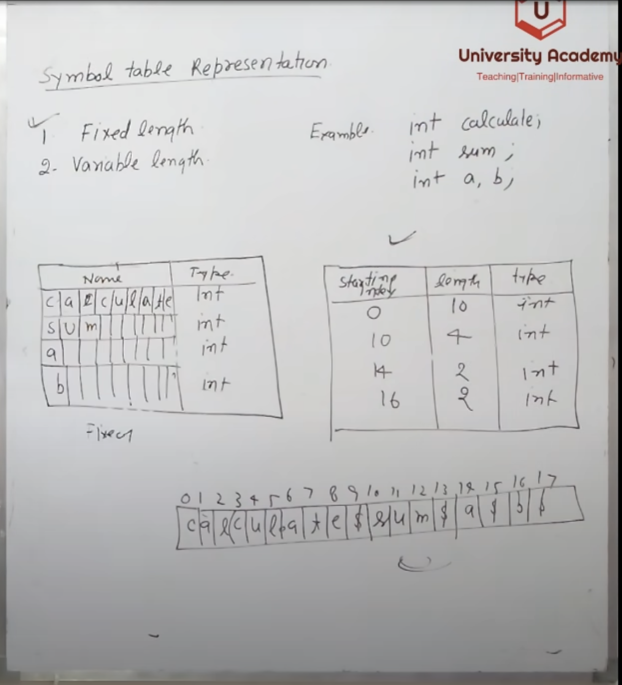

## Symbol Table Operations

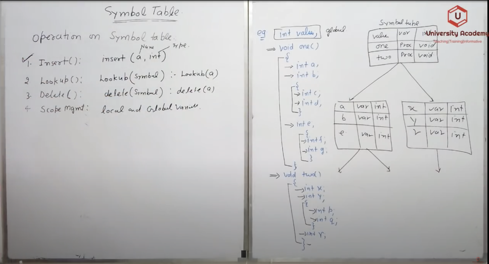

## Implementation of Symbol Table

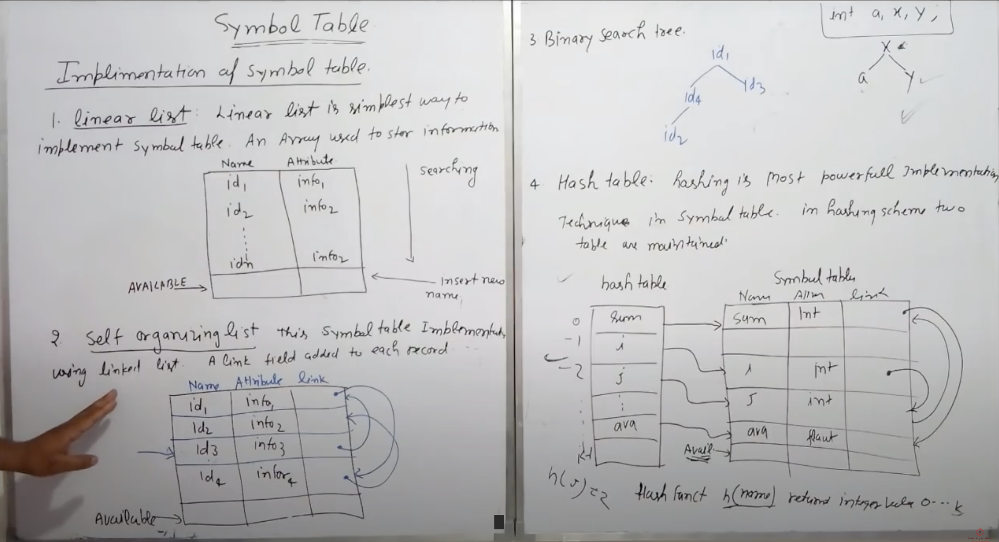

## Run Time Storage Administration

The information which is required in execution of a procedure is kept in a block of storage called activation record.

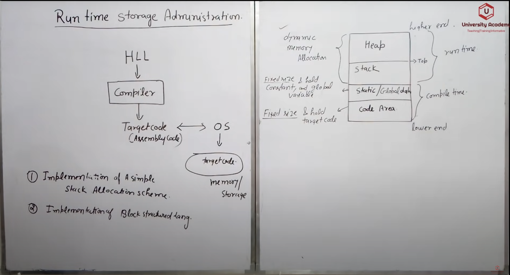

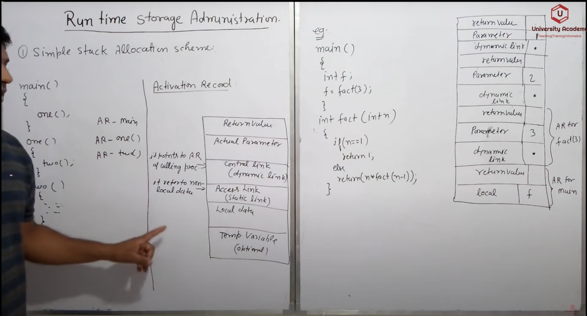

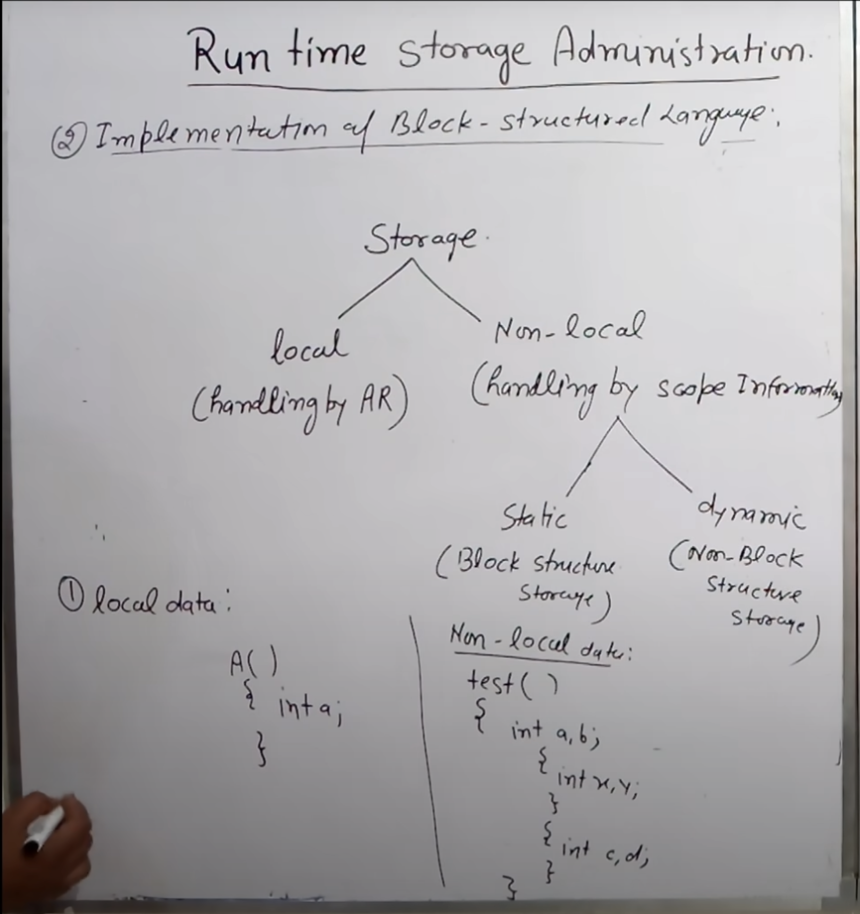

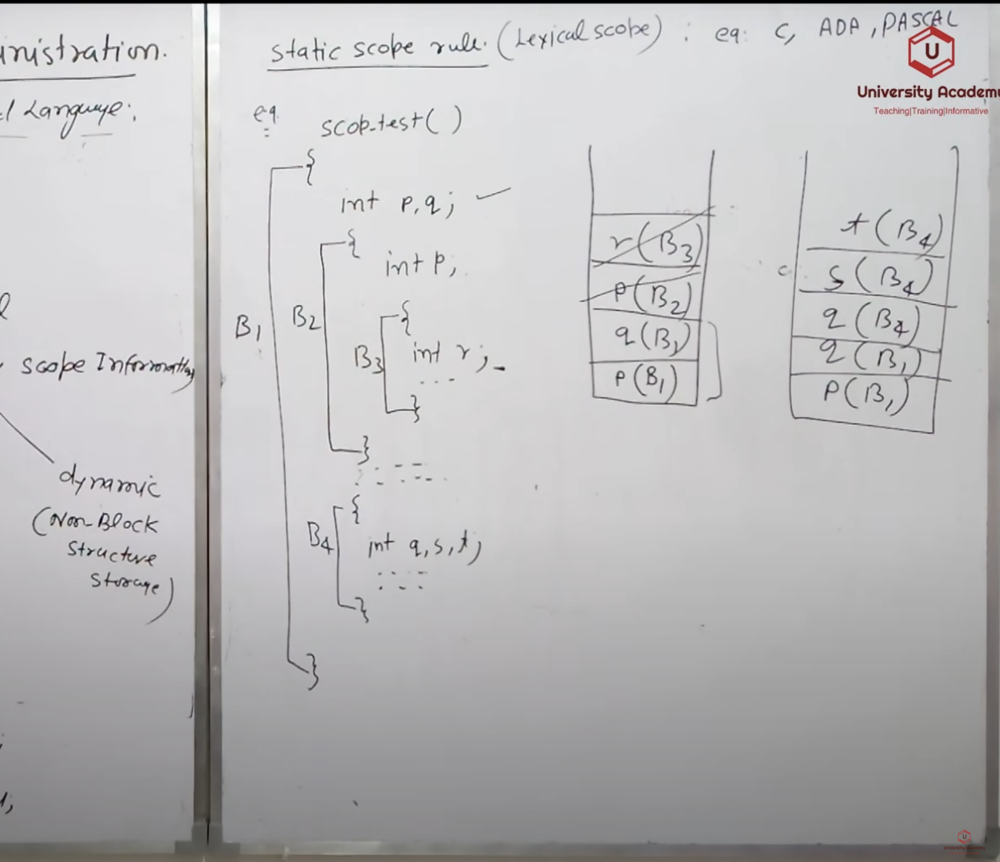

## Error Detection and Recovery

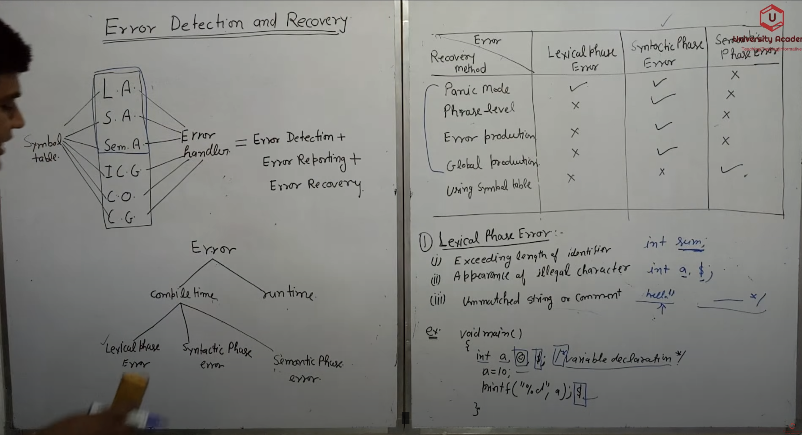

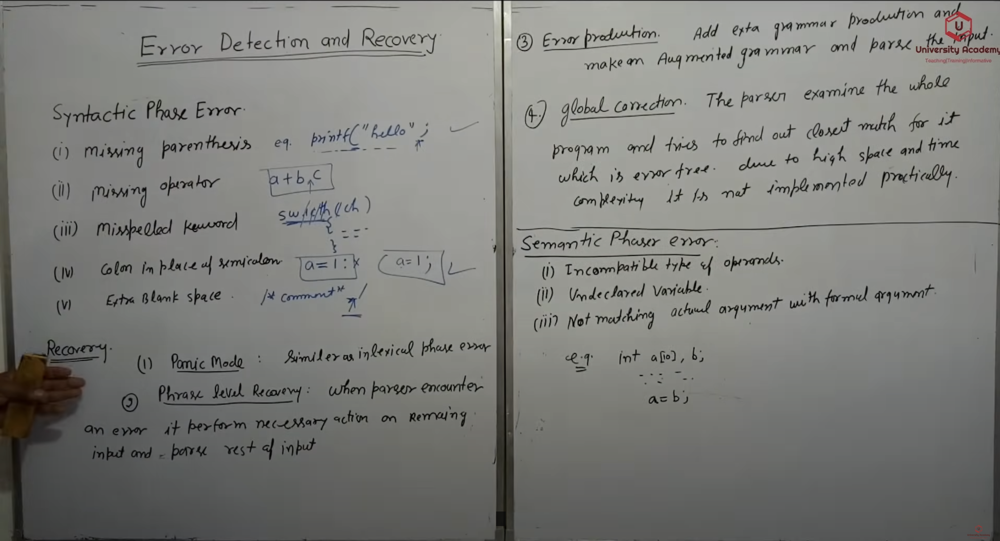

## DAG

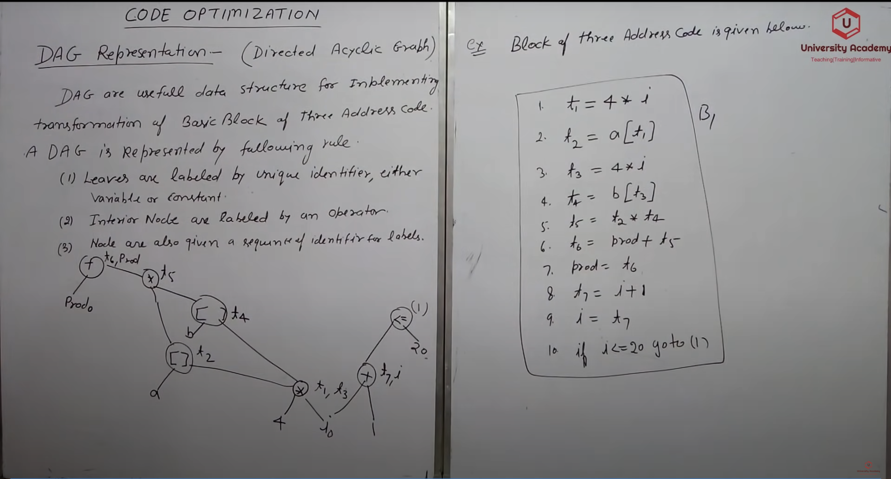

### Application of DAG
- Determine common sub expressions.
- Determine which names are used in a block but are computed in another block.
- Determine which names are computed in a block but are getting used in another block.