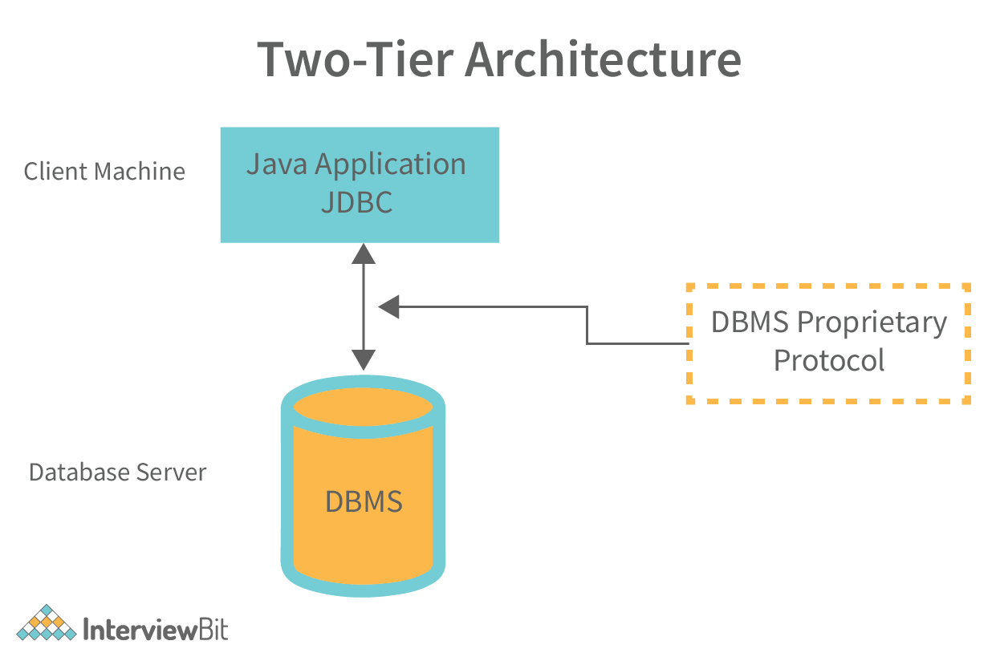
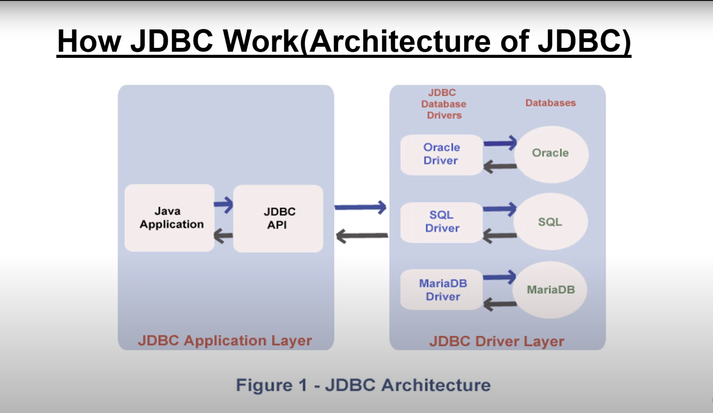
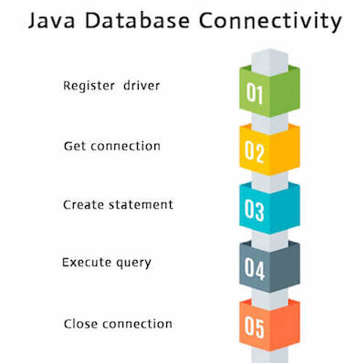

# JDBC (Java Database Connectivity)
- It is a standard API for java application to interact with database.
- It is a specification of Sun Microsystems that provides a standard abstraction (API or protocol) for java applications to communicate with various databases.
- The classes and interfaces of JBDC allows application to send users requests to the database.
- JDBC API uses JDBC drivers to connect with the database.
- Before JDBC, ODBC API was the database API to connect and execute query with database. But ODBC uses an ODBC driver which was programmed in C(i.e., platform-dependent and insecure). That's why Java has defined its own API (JDBC API) that uses JDBC driver (Java).
- The JDBC classes are contained in `java.sql`, `javax.sql`.
**We can use JDBC API to handle database using Java program and can perform the following activities:**
1. Connect to the database
2. Execute queries and update statements to the database
3. Retrieve the result received from the database.

# JDBC Drivers
They are client-side adapters that convert the request from program to a protocol that a specific database can understand.

**There are 4 types of JDBC Drivers:**

## 1. Type-1 Driver
- J**DBC-ODBC bridge driver** or type-1 driver uses ODBC driver to connect the database.
- It converts JDBC method calls into ODBC function calls.
- Also known as universal driver.
- Data transfer is not secured, common driver is used to connect different DBs.
- ODBC bridge driver needed to be installed in client's machine.
- Not portable, not written in java.
- Built in with SDK, no need to install separately.
- Database independent driver.

### Type -2 Driver
- **Native API Driver** uses client – side libraries of the database. 
- It converts JDBC method calls into native call of different APIs.
- In order to interact with database, the driver need to interact with local API.
- Data transfer is secure.
- The driver needs to be installed on the client machine.
- Driver is not written in java, not portable.
- DB dependent.

### Type – 3 Driver
- The **network protocol driver** uses middleware (application server) to convert JSBC method calls into database specific protocol.
- No need of installation, all database connectivity present on single server.
- Portable driver written in java.
- Switch facility to switch over from one DB to another.
- Maintenance of Network Protocol driver becomes costly because it requires database-specific coding

### Tier – 4 Driver
- **Native Protocol Driver**.
- This driver directly interacts with database, does not need any driver library.
- Called **Thin Driver**.
- Does not require any native library and Middleware server, so no client-side or server-side installation.
- It is fully written in Java language, hence they are portable drivers.

# JDBC Architecture
### 2 – Tier Model
- In this mode, application is directly communicating with source of data (database).
- The user's command directly transmitted to the database and result statement is returned to client.
- The source of data can be located on a different machine, and that machine is connected to the user machine following a client-server paradigm


### 3 – Tier Model


# Java Database Connectivity

1. **Register Driver** : 
   - `forName()` method of **Class** class.
   - `registerDriver()` method of **DriverManager**.
   - These methods are used to dynamically loads the driver class.
```java
Class.forName("DB_name");
//  OR
DriverManager.registerDevice("DB_name");
```
2. **Get Connection:**
   - `geConnection()` method of **DriverManager**.
```java
Connection conn = DriverManager.getConnection("url", "username", "password");
```
3. **Create Statement:**
   - The c`reateStatement()` method of **Connection** interface is used to create statement. 
   - The object of statement is responsible to execute queries with the database.
```java 
Statement stmnt = conn.createStatement();
```
4. **Execute Statement:**
   - The `executeQuery()` method of **Statement** interface is used to execute queries to the database. 
   - This method returns the object of ResultSet that can be used to get all the records of a table.
```java
ResultSet rs = stmnt.executeQuery("SELECT * FROM student");
while(res.next()){
	System.out.println(re.getInt(1)+" "+re.getString(2));
	//      OR
	System.out.println(re.getInt("id")+" "+re.getString("name"));
}
```
5. Close Connection
   - By closing connection object statement and ResultSet will be closed automatically. 
   - The `close()` method of **Connection** interface is used to close the connection.
```java
conn.close();
```

# JDBC Statement
- JDBC Statement is an object of **Statement** interface used to execute SQL query.
**JDBC API support 3 types of Statement: **
1. Statement
   - Used for general-purpose access of database.
   - Useful when you are using the static SQL statement at runtime.
   - Statement interface can not contain parameters.
   - No **IN** or **OUT** parameter.
   - Query itself in string format is sent with the interfaceface.
2. Prepared Statement
   - Use when you plan to execute the same query many times.
   - The PreparedStatement interface accepts input parameters at runtime.
   - **IN** parameter.
3. Callable Statement
   - Supports **IN** and **OUT** parameters.

# JDBC CRUD
### 1. Connect to Database:
```java
try{
	Class.forName("db_name");
	Connection conn = driverManager.getConnection("url", "username", "password");
	System.out.println("Connection Established");
}
catch (Exception e){
	e.printStackTrace();
}
```

### 2. Creation of new record:
```java
try{
	Statement stmnt = conn.createStatement();
	String query = "CREATE TABLE student(INT id, VARCHAR(20) name);"
	 stmnt.executeQuery(query)
	String insert_query = "INSERT INTO student VALUES(1, 'Vivek Tripathi');"
	resultSet rs = stmnt.executeQuery(insert_query);
}
catch (Exception e){
	e.printStackTrace();
}
```

### 3. Read a record
```java
try{
	String q = "SELECT * FROM student;"
	resultSet read = stmnt.executeQuery(q);
	while(read.next()){
		System.out.println(read.getInt(1) + " " + read.getString(2));
	}
}
catch(Exception e){
	e.printStackTrace();
}
```

### 4. Update a Record
```java
try{
	String query = "UPDATE student SET column1 = ?, column2 = ?, column3 = ? WHERE id = 1";
	resultSet r = stmnt.executeQuery(query);
}
catch (Exception e){
	e.printStack.Trace();
}
```

### 5. Delete a Record
```java
try{
	String query = "DELETE FRM student WHERE id = 1";
	resultSet r = stmnt.executeQuery(query);
}
catch (Exception e){
	e.printStack.Trace();
}
```