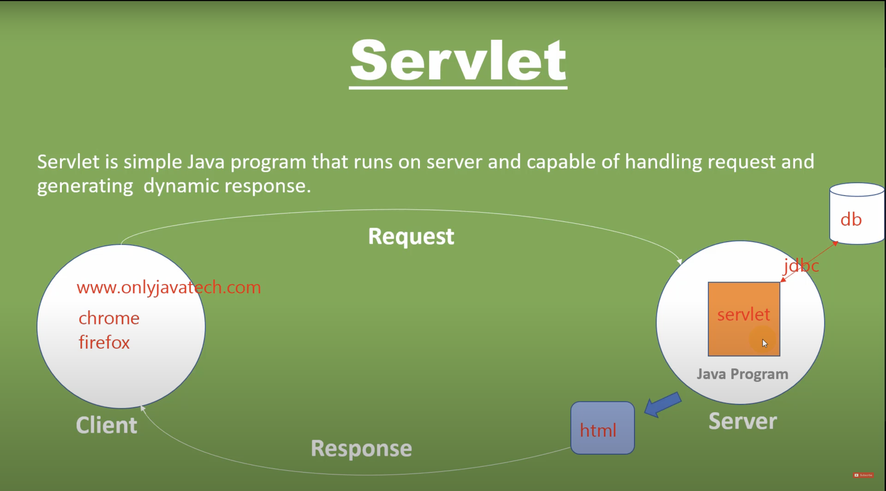
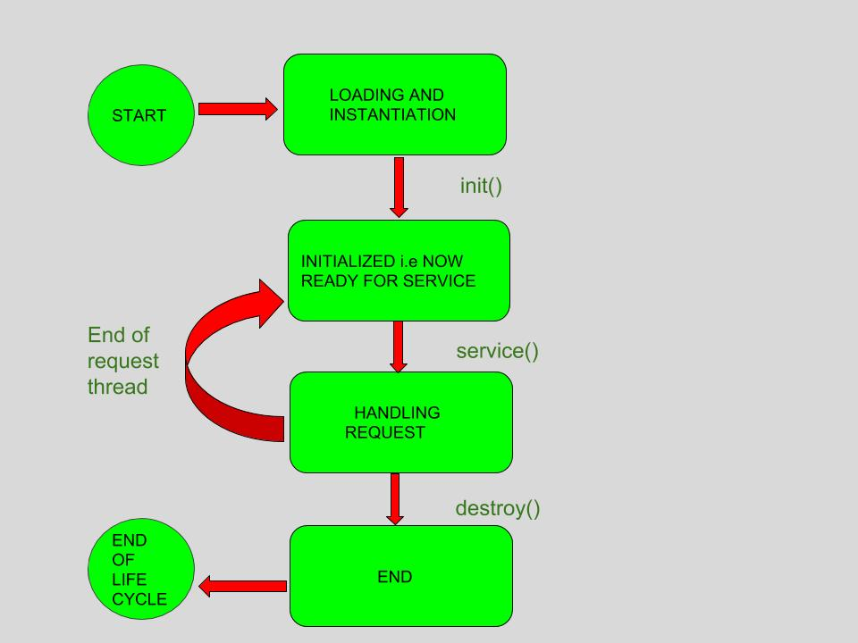
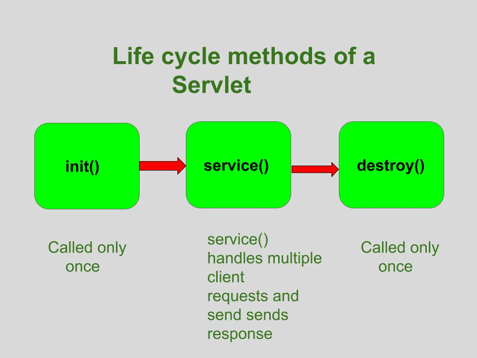
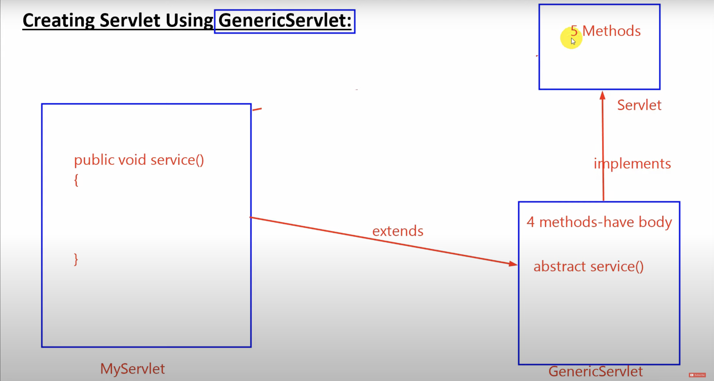
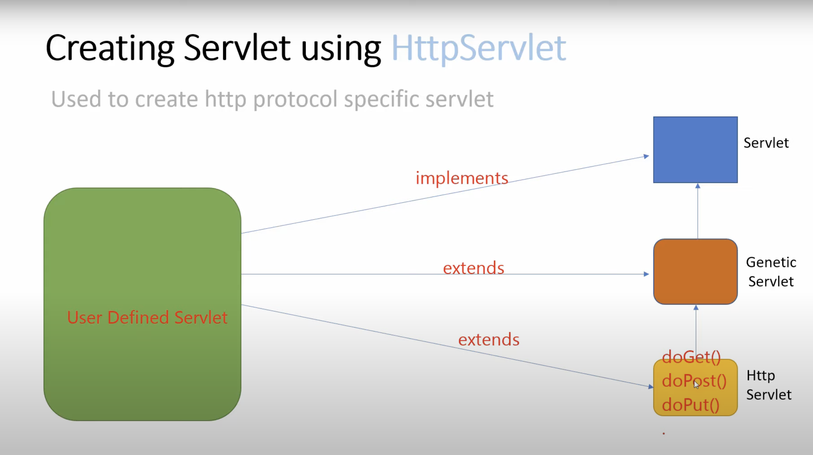
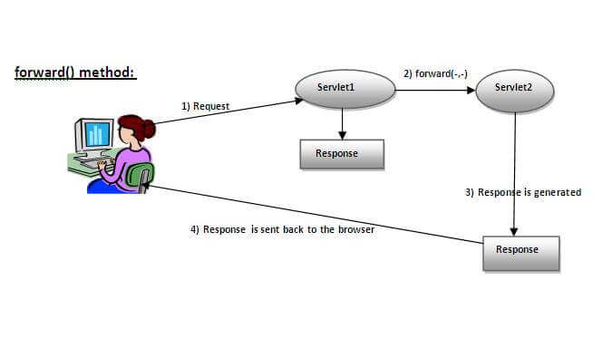
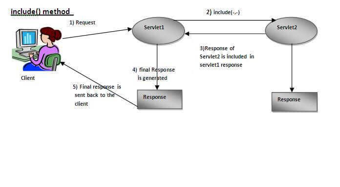

# Java Servlet

- A Java servlet is a Java programming language program(class) that handles client requests on the server-side and dynamically generates web content. It is a key component of the Java Enterprise Edition (Java EE) platform for building web applications. 
- Java Servlet often serves the same as the programs implemented using Common Gateway Interface(CGI). But servlet typically serves advantages over CGI :- 
	1. Performance is significantly better.
	2. Not necessary to create a separate process to handle each client request.
	3. Java Security Manager, responsible for security.
	4. Also connects with DB using JDBC.

# How Servlet Works
1. When the web server (e.g., Apache Tomcat) starts up, the servlet container deploy and loads all the servlets. During this step, Servlet container creates ServletContext object. **ServletContext is an interface that defines the set of methods that a servlet can use to communicate with the servlet container**.
2. Once the servlet is loaded, the servlet container creates the instance of the servlet class. For each instantiated servlet, its init() method is invoked.
3. A client (user browser) sends a Http request to a web server on a certain port. Each time the web server receives a request, the servlet container creates HttpServletRequest and HttpServletResponse objects. The HttpServletRequest object provides the access to the request information, and the HttpServletResponse object allows us to format and change the http response before sending it to the client.
   The servlet container spawns a new thread that calls service() method for each client request. **The service() method dispatches the request to the correct handler method based on the type of request**.
   
4. When servlet container shuts down, it unloads all the servlets and calls destroy() method for each initialized servlets.

# Servlet Container

- Essential part of web server that interacts with java servlets.
- Client request to web server or HTTP server.
- Web server redirects the same to Servlet Container.
- Servlet Container then redirects the request to an appropriate servlet.
**The Servlet Container performs many operations that are given below:** 
1. Life Cycle Management.
2. Object Polling (initializing and invoking servlet methods and to destroy them).
3. Multithreaded support.
4. Security etc.

# Life Cycle of a Servlet
The Entire Life cycle is managed by **Servlet Container,** which uses `java.servlet. Servlet` interface.
1. **Loading Servlet:** Class loader is responsible, it is loaded when first request is received by web container.
2. **Servlet instance is created:** Web container creates instance and created once in a life cycle.
3. **Initializing Servlet:** Web container calls `init()` method, only once after instance is created, used to initialize servlet. It is a method of `java.servlet.Servlet` interface.
   - **Syntax:** `public void init(ServletConfig config) throws ServletException`
4. **Request Handling:** **Service** method is called by web/servlet container each time when request for servlet is received.
   - **Syntax:** `public void service(ServletRequest request, ServletResponse response) throws ServletEception, IOEsception`
5. **Destroying the Servlet:** `destroy()` method is invoked before removing servlet instance, gives an opportunity to clear all resources, such as memory, threads, etc…
   - **Syntax:** `public void destroy()`



# Servlet API #revise
- It is consist of all necessary interfaces and classes used to create Servlet Program.
- Servlet API has 2 packages, namely
1. **`javax.servlet`** contains many interfaces and classes are not specific to any protocol.
2. **`javax.servlet.http`** are responsible for HTTP requests only.
#### `javax.servlet` Interface
1. **Servlet Request Listener:** To generate notification of request coming in or out.
2. **Servlet request:** Defines an object created by the servlet container to pass the request sent by the client to the servlet.
3. **Servlet Response:** Defines an object created by the servlet container to send a response to the client from servlet.
#### `javax.servlet` Classes
1. **ServletInputStream:** Class used to provide input stream to read binary data from client request.
2. **ServletOutputStream:** Class used to provide ouput stream to send binary data to client.
#### `javax.servlet.http` Interface
1. **HttpServletRequest:** To pass HTTP client request information to servlet. It extends the ServletReequest interface.
2. **HttpServletReaponse:** To send HTTP based response to client. It extends the ServletResponse interface.
#### `javax.servlet.http` Classes
1. **HttpServletRequestWrapper:** This class provides implementation of HttpServletRequest interface that can be subclassed to adapt the requests for servlet.
2. **HttpServletResponseWrapper:** This class provides implementation of HttpServletResponse interface that can be subclassed to send responses to client.

# Servlet Interface
- Provides common behavior to all the servlets.
- Servlet interface needs to be implemented for creating any servlet(directly or indirectly).
- **5 methods** = 3 Life cycle methods + 2 non-life cycle methds.
1. `init()`
2. `service()`
3. `destroy()`
4. `getServletConfig():` Returns a ServletConfig object, which contains initialization and startup parameters of the servlet. 
5. `getServletInfo():` Returns information related to servlet, such as author, version, and copyright.

# Generic Servlet Class

GenricServlet implements the servlet instance and implements all its methods except `service()`.
- It defines protocol-independent(HTTP-less)servlet.
- Developing servlet extending GenricServlet is easy because, it only need `service()` method to be implemented.
- This class is in `java.servlet` package(`javax.servlet.GenricServlet`).
```java
public class MyFirstServlet extends GenricServlet
{
	public void service(ServletRequest req, ServletResponse res)
	throws ServletException, IOException
	{
		// Code Here
	}
}
```

# HTTP Servlet Class

- It comes under package `javax.servlet.http.HttpServlet`.
- To create a servlet the class must extends the HttpServlet class and overrides one of its methods(doGet(), doPost(), doDelete(), doPut()).
- HttpServlet Class extends GenricServlet class and implements a serializable interface.
**Methods of HttpServlet Class:**
1. **doGet():** Used to handle GET request on server-side. The GET type requests usually used to process the request.
   **Syntax:** `protected void doGet(HttpServletRequest req, HttpServletReaponse res) throws ServletException, IOExeption`.
2. **doPost():** Used to handle POST request on server-side.
   **Syntax:** `protected void doPOST(HttpServletRequest req, HttpServletResponse res) throws ServletException, IOExpeption`.
3. **doPut():** Used to handle PUT request. This method allows a client to store data on a server.
   **Syntax:** `protected void doPut(HttpServletRequest req, HttpServletResponse res) throws ServletException, IOException`.
```java
public void MyServlet ectends HtttpServlet{
	public void doGet(HttpServletRequest req, HttpServletResponse res)
	throws ServletException, IOException
	{
		// Code to hande doGet request
	}
	public void doPost(HttpServletRequest req, HttpServletResponse res)
	throws ServletException, IOException
	{
		// Code to hande doPost request
	}
}
```

# Request Dispatcher
- Interface comes under `javax.servlet` package.
- Using this package, we get an object after receiving any request.
- Using RequestDispatcher object request is sent to other resources including(HTML file, servlet, or JSP file).
- This object is used to forward a request to a resource or to include the resource in response.
#### 3 ways to create object of Request Dispatcher
1. `RequestDispatcher requestDispatcher = ServlexContext.getRequestDispatcher(String path);`
2. `RequestDispatcher requestDispaatcher = ServlexContext.getNamedDispatcher(String Name);`
3. `RequestDispatcher requestDispatcher = request.getRequestDispatcher(String path);`
#### Methods of Request Dispatcher
###### forward 
- **Syntax:** `void forward(ServletRequest req, ServletRequest res)throws ServletException, IOException`
- **Example:**
```java
import java.io.*;
import java.servlet.*;
import java.servlet.http.*;

public void MyServlet extends HttpServlet{
	public void doGet(HttpServletRequest req, HttpServletResponse res)
	throws ServletException, IOException
	try{
	//Code
	RequestDispatcher requestDispatcher;
	requestDispatcher = request.getRequestDispatcher("path");
	requestDispatcher.forward(request, response);
	}
	catch(ServletException servletException){
	}
	catch(IOException ioException){
	}
	catch(IllegalStateException illegalStateException){
	}
}
```


###### Include
- **Syntax:** `void include(ServletRequest req, ServletResponse res)throws ServletException, IOException`.
- **Example:**
```java
import java.io.*;
import java.servlet.*;
import java.servlet.http.*;

public void MyServlet extends HttpServlet{
	public void doGet(HttpServetRequest req, HttpServletResponse res)
	throws ServletException, IOException
	try{
	RequestDispatcher requestDispatcher;
	request Dispathcher = request.getRequestDispatcher("path");
	requestDispatcher.include(request, response);
	}
	catch(ServletException servletzException){
	}
	catch(IOException ioException){
	}
	catch(IllegalStateException illegalStateException){
	}
}
```
