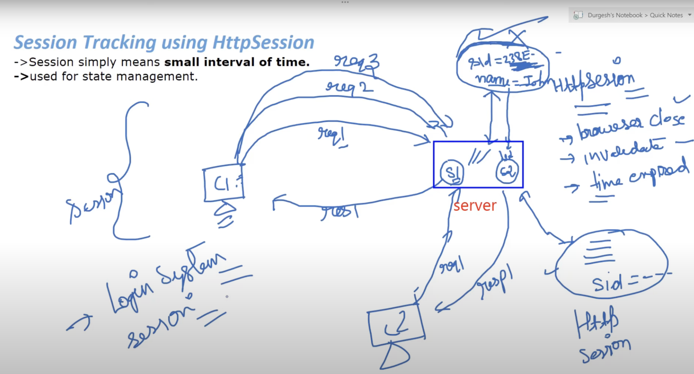

# Session
- It refers to the period of interaction b/w user and website.
- It starts when user logins and ends when user logout or remains inactive for a long amount of time(session timeout).
- They keep track of data related to user and information related to user activities and preferences, which are then used to managing states of the website and providing a personalized experience for user.
- They store login credentials, shopping carts content, user preferences, and other user interaction with the website.

## Working of Session

1. ==**Session Initialization:**== When a user visits a website, a session is initiated. The server assigns a unique identifier (session ID) to the user and sends it to the user's browser. This identifier is often stored in a cookie or appended to the URL.
2. **==Session ID Transmission:==** The session ID is included in subsequent requests made by the user's browser to the website. This allows the server to recognize and associate those requests with the corresponding session.
3. ==**Server-side Data Storage:**== The server maintains a data structure (session store) to store and manage session-related data. This data can include information like the user's login status, shopping cart contents, user preferences, and any other relevant data.
4. ==**Associating Session Data:**== With each request from the user, the server retrieves the session ID from the request. Using this session ID, the server retrieves the corresponding session data from the session store.
5. ==**Modifying Session Data:**== As the user interacts with the website, session data can be modified or updated. For example, if the user adds items to their shopping cart, the session data will be updated to reflect those changes.
6. ==**Session Expiration:**== Sessions typically have an expiration time or timeout to ensure that inactive sessions are eventually cleared. If a user remains inactive for a specified period, the session may expire, and the associated session data is removed from the session store.
7. ==**Session Termination:**== A session ends when the user explicitly logs out or closes their browser. Upon session termination, the session data is cleared, and the session ID becomes invalid.

# Session Tracking in Servlet
- It is a way to maintain the state (data) of a user.
- Also known as **State Management**.
- Session is necessary because HTTP is a stateless protocol.
## Session Tracking Techniques
1. Cookie
2. Hidden Form Field
3. URL Rewriting
4. Http Session
### 1. Cookie
- Cookies are small pieces of data sent by the server to the client's browser and stored on the client's machine.
- Data in the cookie is stored in the form of key-value pair.
- They can be used to store the session ID, which is then sent back to the server with each subsequent request.
- Servlets can retrieve the session ID from the cookie and associate it with the corresponding session data on the server.
##### Advantages
1. Simple technique to maintain the stage.
2. Stored at client-side.
##### Disadvantages
1. It'll not work if cookie is disabled from the browser.
2. Only textual information can be sent to the cookie object.
##### Example:
```java
import java.io.*;
import java.servlet.*;
import java.servlet.http.*;
public void MyServlet extends HttpServlet{
	public void doGet(HttpServletRequest req, HttpServletReaponse res)
	throws ServletExcpeption, IOException;
	try{
		response.setContentType(text/html);
		String seesion_id = request.getParameter("username");
		Cookie cookie = new Cookie("username", session_id);
		response.addCookie(session_id);
		// Rest of code
	}
	catch(Exception e){
		System.out.Println(e);
	}
}
```

### 2. Hiding Form Field
- This technique including a hidden form field in each HTML form generated by server.
- The hidden form field contains session_id, which is sent back to the server when the form is submitted.
- A servlet can extract the session ID from the form parameter and use it to maintain stage.
##### Advantages
- It will work weather cookie is disabled or not.
##### Disadvantages
- It is maintained at server side.
- Extra form submission is required on each page.
- Only text information can be used.
##### Example:
```java
import java.io.*;
import java.servlet.*;
import java.servlet.http.*;
public void MyServlet extends HttpServlet{
	public void doGet(HttpServletRequest req, HttpServletReaponse res)
	throws ServletExcpeption, IOException;
	try{
		response.setContentType(text/html);
		PrintWriter out = response.getWriter();
		String seesion_id = request.getParameter("username");
		// Rest of code
		out.print("<form action = 'Servlet1' >");
		out.print("<input type = hidden'  name = 'username' value = 'session_id'>");
		out.print("<input type = 'Submit' value = 'Go'>");
		out.close();
	}
	catch(Exception e){
		System.out.Println(e);
	}
}
```

### 3. URL Rewriting
- With this, the session ID is appended to the URL as a parameter.
- Each link include session ID which make server to identify the session, when request is made.
- `url?namel=value1&name2=value2&??`
##### Advantages
- It will work weather cookie is disabled or not. 
- Extra form submission is not required on each page.
##### Disadvantages
- It will work only with links.
- It can send only textual information.
##### Example:
```java
import java.io.*;
import java.servlet.*;
import java.servlet.http.*;
public void MyServlet extends HttpServlet{
	public void doGet(HttpServletRequest req, HttpServletReaponse res)
	throws ServletExcpeption, IOException;
	try{
		response.setContentType(text/html);
		PrintWriter out = response.getWriter();
		String seesion_id = request.getParameter("username");
		// Rest of code
		out.print("<a href = 'servlet/username?="+session_id+"'>Visit</a>");
		out.close();
	}
	catch(Exception e){
		System.out.Println(e);
	}
}
```

### 4. HTTP Session
- When a user initiates a session, the server creates an HttpSession object and associates it with the user. 
- The session ID is automatically maintained and sent to the client as a cookie. 
- Servlets can access the HttpSession object using the `request.getSession()` method to store and retrieve session attributes.
- `HttpSession session = request.getSession();`
- `Session.setAttribute("username", "password");`

##### Example 
```java
import java.io.*;
import java.servlet.*;
import java.servlet.http.*;

public void MyServlet extends HttpServlet{
	public void doGet(HttpServletRequest req, HttpServletRequest res)
	throws ServletException, IOException;
	{
		HTTPSession = requestSession(true);
		String UserIDKey = new String("UserIDKey");
		String UserID = new String("UserID");
		// Check if this is new comer on your web page.
		if(Session.isNew()){
		Session.setAttribute(UserIDKey, UserID);
		}
	}
}
```