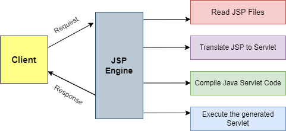

# Java Server Page
[Java Service Page](https://www.geeksforgeeks.org/introduction-to-jsp/)

# JSP Architecture
- Provides a high level working of JSP.
- 3-Tier Architecture.

- **Client:** It is a web browser/application on the user side.
- **Database:** It is used to store data and web browser has its access.
- **Web Browser:** It uses JSP Engine, i.e., container that processes for JSP. Example–Apache Tomcat has built it JSP. JSP Engine intercepts requests for JSP, provides a runtime environment for understanding and processing JSP files and return response in HTML file.
### JSP Architecture Flow

1. The user navigates to `.jsp` extension and browser initiates an HTTP request to the Web Server.
2. If the compiled version of JSP file available in the server, it returns the file. Otherwise, the request is forwarded to JSP Engine.
3. JSP Engine translates the JSP into Servlet by converting template text into `println()` and JSP elements to java code.
4. Servlet Code is compiled into executable format (.class) and forwarded to the Servlet Engine.
5. The Servlet Engine executes the .class file that generated an HTML file. The servlet engine further passes the generated HTML file to the web server.
6. The web server forwards the HTML file to the client's browser.

# JSP Life Cycle

1. **Translation:** It deals with the syntax correctness of JSP page. The JSP container checks JSP code(index.jsp) and translate it into Java Servlet Code(index.java).
2. **Compilation:** Deals with compilation of servlet file(index.java) and convert it into class file(index.class).
3. **Loading & Instantiation:** The class loader loads the java class file into the memory and instances of the class are generated.
4. **Initialization:** `jspInit()` method is called after instantiation. This method is called only once during the whole life cycle. This method can be overridden.
5. **Request Processing:** Deals with handling requests generated by the client. Most time-consuming phase. New thread is used for every request (it is multi-thread) and servlet request and response object is created, then `_jspService()` method is invoked. Cannot be overridden.
6. **Destroy:** `jspdestroy()` method is invoked. Can be overridden. Once in a life cycle. Unloads class from memory.

# Java Syntax
## The Scriptlet
- lt is used to write java programming statements, variable, or methods declaration or any expression that is valid in page scripting language
- **Syntax:** `<% code fragment %>`
```java
<jsp:scriplet>
	// code fraagment
</jsp:scriplet>
```

```jsp
<html>
	<body>
		Hello World!
		<%
			out.println("Your IP Adress : " + request.getRemoteAddr());
		%>
	</body>
</html>
```

## JSP Declaration
- Is used to declare one or more variables or methods that you use in java code in jsp.
- A variable must be declared before using it.
- **Syntax–** `<%! declaration; %>`
```java
<jsp:declaration>
	// code fragment
</jsp:declaration>
```

```jsp
<%! int i = 0;%>
<%! int a, b, c;%>
<%! Circle c = new Circle(2.0);%>
```

## JSP Expression
- Contains a scripting language expression that is evaluated, converted into string, and inserted where the expression appears in JSP.
- Because the value of an expression is converted to a String, you can use an expression within a line of text, whether it is tagged with HTML, in a JSP file.
- The expression element can contain any expression that is valid according to the Java Language Specification but you cannot use a semicolon to end an expression.
- **Syntax–** `<%= code fragment%>`
```java
<jsp:expression>
	// expressoin
</jsp:expression>
```

```jsp
<html>
	<body>
		Today's date : <%= getDate() %>
	</body>
</html>
```

## JSP Comment
`<%-- Comment Here --%>`

## JSP Directive
- JSP directives are elements of JSP source code that gives direction or guides the web container on how to translate JSP page into respective servlet.
- **Syntax–** `<%@ directive attribute = "value"%>`
**Three types of JSP Directives:**
1. **Page Directive:** 
   - Used to define the properties applying on the JSP page, such as size of allocated buffer, importing packages, classes and interfaces, defining what type of page is it, etc…
   - **Syntax–** `<%@ page attribute = "value"`
   - **Examples–**
```jsp
<%@ page import = "value" %>
<%@ page contentType = "value" %>
<%@ page info = "value" %>
<%@ page buffer = "size in kb" %>
<%@ page errorPage = "true/false" %>
```

```java
< jsp:directive.page import = "value" />
< jsp:directive.page contentType = "value" />
< jsp:directive.page info = "value" />
< jsp:directive.page buffer = "size in kb" />
< jsp:directive.page errorPage = "true/false" />
```

2. **Include Directive:** 
   - JSP include directive is used to include other files into the current JSP page. 
   - These files can be HTML files, other JSP files etc. 
   - The advantage of using an include directive is that it allows code re-usability.
   - **Synatx–** `<%@include file = "file location"%>`
   - **Examples–**
```jsp
<% include file = "a.html" %>
```

3. **taglib Directive:** 
   - The taglib directive is used to mention the library whose custom-defined tags are being used in the JSP page.
   - **Syntax–** `<%@taglib uri = "library url" prefix="the prefix to identify the tags of this library with"%>`
   - **Example–**
```jsp

<%@ taglib uri = "[http://java.sun.com/jsp/jstl/core](http://java.sun.com/jsp/jstl/core)" prefix = "c" %>

<``c:out` `value` `=` `"${'This is Sparta'}"``/>
```

## JSP Actions
- It provides various tags that  are used to control the flow of pages and to use Java Beans.
- Can dynamically insert files, use javaBeans, and forward user to another page.
```jsp
//Syntax–
	< jsp:action_name attributes = "value" />
```
- It provides various tags.
- Each tag is used for specific purposes.
- Some tags are discussed below:
  1. **jsp:forward–** Forwards the requester to a new page.
  2. **jsp:include–** Includes a file at the time the page is requested.
  3. **jsp:useBean–** Finds or instantiates a JavaBean.
  4. **jsp:setProperty–** Sets the property of a JavaBean.
  5. **jsp:getProperty–** Inserts the property of a JavaBean into the output.

# JSP Implicit Objects
- These Objects are the Java objects that the JSP Container makes available to the developers in each page and the developer can call them directly without being explicitly declared. 
- These are created during the translation phase of JSP to servlet.
- JSP Implicit Objects are also called pre-defined variables.
- There are 9 total implicit object that are as follows: #revise 
  1. **request–** Object o `HttpServletRequest` for request of client.
  2. **response–** Object o `HttpServletResponse` for response to client.
  3. **out–** Object of `JspWriter` to send any data dynamically.
  4. **session–** Object of `javax.servlet.HttpSession`.
  5. **config–** Object of `ServletConfig`.
  6. **pageContext–** Instance of `PageContext`.
  7. **application–** Instance of `ServletContext`.
  8. **page–** Instance of `Page`.
  9. **exception–** Instance of `throwable`.

## JSP client Request
- When a browser requests a webpage, it sends tons of data to the online server which cannot be directly read by the server because data travels in the header of the HTTP Request.
- We make use of this information using `HttpServletRequest` object.
- **HttpServletRequest Object–** It is an instance of `javax.servlet.http.HttpServletRequest`. Each time a client requests a page, the JSP engine creates a replacement object to represent that request. It extends the ServletRequest interface to provide request information for HTTP servlets.
##### **Request Headers in JSP**
1. **Accept:** It specifies the MIME types that the browser or other clients can handle.
2. **Accept-Charset:** It specifies the character sets that the browser can use to display the information.
3. **Accept-Encoding:** It specifies the types of encodings that the browser knows how to handle.
4. **Accept-Language:** It specifies the client’s preferred languages in case the servlet can produce results in more than one language.
5. **Authorization:** It is used by the clients to identify themselves when accessing password-protected webpages.
6. **Connection:** It indicates whether the client can handle persistent HTTP connections.
7. **Content-Length:** It is applicable only to POST requests and gives the size of the POST data in bytes.
8. **Cookie:** It returns cookies to serves that previously sent to the browser.
9. **Host:** It specifies the host and port as given in the original URL.
##### Methods of `HttpServletRequest` object
1. `getSession()`.
2. `getAttributeName()`.
3. `getHeaderName().`
4. `getPaameterName().`

## JSP server Response
- When the request of the client is processed, a response is generated from the web browser which contains status line, blank line, header, and document.
- `HttpServletResponse` Object
##### Response Header in JSP
1. **Content-Encoding:** It specifies the way in which the page was encoded during transmission.
2. **Content-Language:** It signifies the language in which the document is written.
3. **Content-Length:** It indicates the number of bytes in the response.
4. **Content-Type:** It gives the MIME type of the response document.
5. **Expires:** It specifies the time at which the content should be considered out of date.
##### Methods of `HttpServletResponse`
1. `setHeader()`.
2. `addHeader()`.
3. `addCookie()`.
4. `setContentType()`.
5. `setStatus()`.

## [JSP Integration with Database](https://www.tutorialspoint.com/jsp/jsp_database_access.htm)
**1. Create Table**
**2. Create Data Record**
**3. Operations**
1. **SELECT Operation:** 
```jsp
<sql:query datasource = "${snapshot}" var = "result">
	SELECT * FROM employee;
</sql:query>
```
2. **UPDATE Operation:** 
```jsp
<sql:update datasource = "${snapshot}" var = "result">
	INSERT INTO employee VALUES (104, 2, 'Vivek', 'Tripathi');
</sql:update>
```
3. **DELETE Operation:**
```jsp
<sql:update datasource = "${snapshot}" var = "result">
	DELETE FROM employee WHERE id = 104;
<sql:update>
```


## JSP Session
- It is most regularly used instance of `HttpSession`.
- It is mainly used to approach all data of the user when the session is active.
**Methods used in session implicit object are as follows:** 
1. `isNew()`.
2. `getId()`.
3. `getAttribute()`.
4. `getMaximunInactiveInterval()`.
5. `getLastAccessedTime()`.
6. `removerAttribute()`.
7. `invalidate()`.