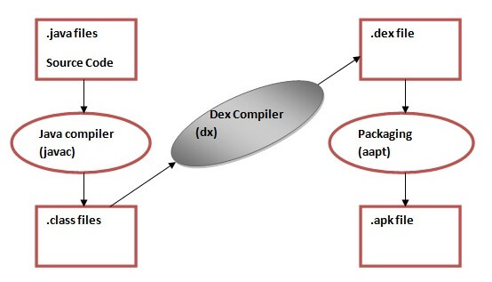

# Android
- It is open-source and Linux-based O/S for mobile devices such as smartphone and laptop computers.
- Developed by Open Handset Alliance(OHA) led by Google.
- Beta version – 2007, first commercial version Android 1.0 September 2008.
- Unified solution for developers, they just need to develop android application which run on different android based devices.
#### Features
1. Open Source
2. Connectivity – GSM, WDCM, BT, WiFi.
3. Various APIs helps in location tracking, such as GPS.
4. Data management using Files.
5. File sharing using BT, Wi-Fi.
6. Supports wide range of media files.
7. Support wide range of image files.
8. Multitasking.

# Dalvik Virtual Machine
- It is a register based android virtual machine for mobile devices, optimized for storage, battery life and performance.
- Named after a fishing village, Dalvik of an iceland.

- The **javac tool** compiles the java source file into the class file.
- The **dx tool** takes all the class files of your application and generates a single .dex file. It is a platform-specific tool.
- The **Android Assets Packaging Tool (aapt)** handles the packaging process.
#### Advantages
- Supports Android.
- Faster Execution.
- Own JIT(Just In Time) Compiler.
- DVM executable is APK.
- Can run multiple instance of VM.
#### Disadvantages
- Only Android O/S.
- App installation takes time due to DEX.
- More internal storage is required.

# APK – Android Application Package
- File Extension – .apk
- File format used to install application on O/S.
- A program in android is first compiled, and all of its parts are packaged into single file to make it APK file.
- It contains information about application.
**Directories inside the .APK file:**
1. **Meta-INF Directory**: Stores metadata of application.
2. **lib Directory:** Platform independent compiled code.
3. **res Directory:** Resources that failed to compile during resource generation.
4. **asset Directory:** asset that it receives from Asset Manager.
5. **Android Manifest file:** Contains information about app name, app icon, permission needed.
6. **dex File:** file for DVM.
7. **srsc:** Contains built version of XML version.

# Android Development Component
1. [Activity](03_Android_Fundamental&UI_Design.md)
2. [Services](07_Notification_and_Services)
3. [Broadcast Receiver](07_Notification_and_Services)
