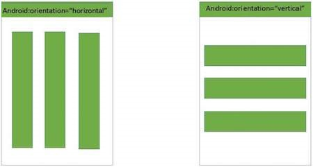

# Activity
- It is one screen of an app.
- The most specific block of User Interface.
- An app must have at lest one activity.
- It is a combination of XML and Java Code.
- It is a container that contains design as well as coding stuff.
- XML files provide the design of the screen and JAVA files deal with all coding stuff like handles, what is happening, design files, etc.
- JAVA files and XML files make your activity complete.
- In android manifest, we organize the activities in parent-child relationship to aid the navigation.
- The **main activity** is the first activity.
```java
public class HomeActivity extends Activity{
	// Code
}
```

# Activity Life Cycle

1. **onCreate():** Called when activity is first created. This is where all work is done such as creating views, binding data, etc...
2. **onStart():** Called when activity is visible to user. Invoked after `onStart()`.
3. **onResume():** when activity starts interacting with user. Activity is at the top of the activity stack
4. **onPause():** when activity is invisible to user but running in background. When any activity is launched in front of other activity, this is invoked.
5. **onStop():** activity is no longer visible to user. When activity is revoked from background this is invoked.
6. **onRestart():** invoked after your activity has been stopped and prior to starting stage. Followed by `onStart()`.
7. **onDestroy():** invoked when activity is finished or being destroyed by the system.
#imp
```java
public class mainActivity extends Activity{
	@override
	protected void onCreate(Bundle savedInstanceState){
		super.onCreate(savedInstanceState);
		SetContentView(R.layout.activity_main)
		Log.d("onCreate invoked");
	}
	@override
	protected void onStart(){
		super.onStart();
		Lof.d("onStart invoked");
	}
	@override
	protected void onResume(){
		super.onResume();
		Log.d("onResume invoked");
	}
	@override
	protected void onPause(){
		super.onPause();
		Log.d("onPause invoked");
	}
	@override
	protected void onStop(){
		super.onStop();
		Log.d("onStop invoked");
	}
	@override
	protected void oRestart(){
		super.onRestart();
		Log.d("onRestart invoked");
	}
	@override
	protected void onDestroy(){
		super.onDestroy();
		Log.d("onDestroy invoked");
	}
}
```

# Permission System
- Part of app that tell what they can and can't access.
- Permission are usually defined in manifest file.
**Types of Permissions:**
1. **Install Time Permission:** Requested during the installation time of app. Android 5 or lower.
2. **Run Time Permission:** Requested at run time during the app is running. Android 6 or higher.
```xml
<!--Declaring the permissions of camera-->
<uses-permission android:name="android.permission.READ_EXTERNAL_STORAGE" />
<uses-permission android:name="android.permission.WRITE_EXTERNAL_STORAGE"/>
<uses-permission android:name="android.permission.CAMERA"/>
```

# Basic UI Components
### Text View
- UI component which displays the text to the user on the screen.
- Can be created by XML and Activity.
```xml
<Linear Layout xmls:android="http://schemas.android.com/apk/res/android"
	android:layout_width="match_parent"
	android:layout_height="match_parent">
	<TextView
			// attributes to describe it
	/>
</Linear Layout>
```

### Edit Text View
- UI component that allows user to play with text.
```xml
<Linear Layout xmls:android="http://schemas.android.com/apk/res/android">
	<EditText
			  // attribute to declare Edit Text
	/>
</Linear Layout>
```

### Button
- Used to perform some specific action as soon as when user clicks on it.
```xml
<Linear Layout xmls:android="http://schemas.android.com/apk/res/android">
	<Button
			// attribute to declare Edit Text
	/>
</Linear Layout>
```

### Radio Button
- Having two possible stares, checked and unchecked.
- Initially it is in unchecked state, once it is checked it can not be unchecked.
- Only one item in a list can be checked.
```xml
<Linear Layout xmls:android="http://schemas.android.com/apk/res/android">
	<RadioButton
			android:text="Radio Button"
			android:checked="true"
			// other atttributes of radio button
	/>
</Linear Layout>
```

### Image View
- UI component that displays images on the user's screen of any format.
```xml
<Linear Layout xmls:android-"http;//schemas.android.com/apk/res/android">
	<ImageView
		// Attribites for image
	/>
</LinearLayout>
```

### Check Box
-  Button having two possible stares, checked and unchecked.
- Can we checked as many item of a list wanted, unlike radio button.
```xml
<Linear Layout xmls:android="http://schemas.android.com/apk/res/android">
	<CheckBox
			android:text="Check Box"
			android:checked="true"
			// other atttributes of Check Box
	/>
</Linear Layout>
```

### Progress Bar
- In Android, we have a progress bar that shows the progress of some action that is happening like pasting a file to some location. A progress bar can be in two modes:
	1. **Determinate Mode:** In this, the progress is shown with the percent of action completed. Also, the time to be taken is already determined.
	2. **Indeterminate Mode:** In this, there is no idea of when the task would be completed, therefore, it functions continuously.
```xml
<Linear Layout xmls:android="http://schemas.android.com/apk/res/android">
	<ProgressBar
		// Attribute like speed, time, layout, id sec, etc are defined here
	/>
</Linear Layout>
```

# Event Handling in Android
- **Event:** Action performed by the user in order to interact with the application. For ex.– pressing a button or touching the screen.
- Events are managed by the android framework in the FIFO manner.
- Handling such events by performing desired tasks called **Event Handling**.
**Overview of input event management**
- **Event Listeners:** It is an interface in the view class. It contains one callback method. Once the view to which listener is associated is triggered, callback method is called.
- **Event Handler:** Responsible for dealing with the event that event listener is registered for performing the desired action for that event.
- **Event Listener Handler:** Process by which event listener get associated with event handler, so that this handler is called when respective event listener fires the event.
**Event Listener and their respective event handlers**
- **onCLickListener():** This is called when user clicks, touches, or focuses on any widget like button, image, text, etc… **onClick()** handler is used.
- **onLongClickListener():** This is called when user clicks, touches, or focuses on any widgets like buttons, images, text, etc... **onLongClick()** handler is used.
- **onMenuItemClickListener():** This is called when a user clicks, touches on a Menu Item. **onMenuItemClick()** handler is used to handle this event.
- **onTouchListener():** This is called when user does any movement gesture on screen. **onTouch()** handler is used.

# UI Layout
- They are used to define user interface of UI controls that are displays on the screen.
- Generally, Application is the combination of view and view groups.
- Layout is used to describe how these views and view groups are gonna look like on the screen.
**Attributes of Layouts:** Android layout has a set of attributes to define visual properties of layout.
- **andriod:id**: uniquely identifies each view.
- **android:layout_width**
- **android:layout_height**
- **android:layout_marginTop**
- **android:layout_marginBottom**
- **android:layout_marginLeft**
- **android:layout_marginRight**
- **android:layout_gravity**
- **android:layout_weight**
### Types of UI Layout
#### 1. Linear Layout
- In this layout, each of it's child view is either in horizontal orientation or in vertical orientation.
- A vertical layout has columns of views and a horizontal layout has rows of views.
- **android:orientation** attribute is used to set orientation of child views.

```xml
<Linear Layout xmls:android="https://schemas.android.com/apk/res/android">
	android:layout_height="match_parent"
	android:layout_width="match_parent"
	android:layout_orientation="vertical"
	<!-- Add Child Views here -->
```

#### 2. Relative Layout
- It enables you to specify how child views are positioned relative to each other.
- The position of each view can be relative to its sibling elements or its parents elements.

```xml
<Relative Layout xmls:android="http;//schemas.androisd.com/apk/res/android">
	android:layout_height="fill_parent"
	android:layout_width="fill_parent"
	<!-- Add Child Views here -->
```

#### 3. Frame Layout
- Generally, frame layout is used to add single child to the whole screen.

- Several Children to a frame layout can also be added and mange by **android:gravity** attribute.
- By default, the position is top-left corner by it can be changed by gravity attribute.


#### 4. Coordinate Layout
- It is a super powered frame layout.
- It coordinates the animation and transition of child views with one another.

1. **Px:** Pixels – corresponds to actual pixels on the screen.
2. **Pt:** Points – 1/72 of an inch based on the physical size of the screen.
3. **Dp or dip:** Density-independent Pixels – an abstract unit that is based on the physical density of the screen. These units are relative to a 160 dpi screen, so one DP is one pixel on a 160 screen. The ratio of dp-to-pixel will change with the screen density, but not necessarily in act proportion. Note: The compiler accepts both “dip” and “p”.
4. **Sp:** Scale-independent Pixels-this is like the DP unit, but it is also scaled by the user's size preference. It is recommended you use this unit when specifying font sizes, so they will be used for both t h e screen density and user's preference.

# Intents
- It is a messaging object that is used to navigate among various activities with same application or between applications.
**Applications of Intents:**
1. Sending the user to another app.
2. Getting the result from activity.
3. Allowing other app to start your activity.
4. Display a web page.
5. Display a list of content.
6. Broadcast a message.
7. Dial a phone call, etc…
**Important methods of intent:**
- **Context.startActivity():** It is used to start a new activity or existing activity to perform any required operations.
- **Context.startService():** It is used to start a new service or send required instruction to existing services.
- **Context.sendBroadcast():** It is used to send a message to a broadcast receiver.

### Types of Intent
#### 1. Implicit Intent
- Using implicit intent component can't be specified.
- An action to be performed is declared by implicit intent.
- Android O/S then filter out the components that will respond to the action.
- **For example:**

#### 2. Explicit Intent
- Using explicit intent component is specified.
- Targeted component is specified in explicit content.
- So only the specified target component will be invoked.
- **For example:**

