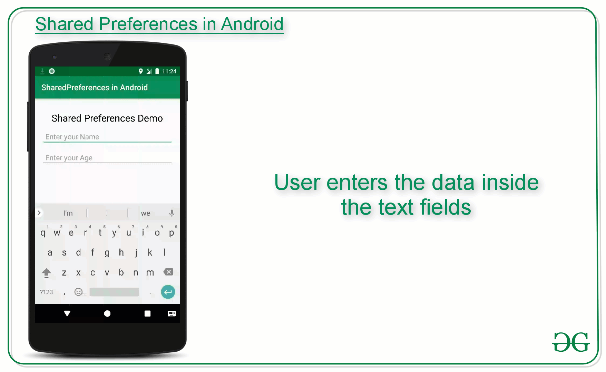

# Menu 
- In android Menu is important part of UI Component.
- It provides a list of items.
- It provides various functionality throughout the application.
- In order to use menu, It is defined in separate XML file and used at various places in application as per the need of application.
- Menu APIs are also used to represent user action and other options through android application activities.
```xml
<Menu xmls:android="https://schemas.android.com/apk/res/andriod">
	<item android:id="@+id/mail"
		android:icon="@drawable/ic_mail"
		android:string="@string/mail" />
	<item android:id="@+id/upload"
		android:icon="@drawable/ic_upload"
		android:string="@string/upload" />
	<item android:id="@+id/share"
		android:icon="@drawable/ic_share"
		android:string="@string/share" />
</Menu>
```

```xml
<Menu xmls:android="https://schemas.android.com/apk/res/andriod">
	<item android:id="@+id/mail"
		android:icon="@drawable/ic_mail"
		android:string="@string/mail"
			<Menu>
				<item android:id="@+id/create"
					android:icon="@drawable/ic_create"
					android:string="@string/create" />
				<item android:id="@+id/open"
					android:icon="@drawable/ic_open"
					android:string="@string/open" />
	</item>
</Menu>
```

### Option Menu
- It is usually found at the top of the application.
- Generally, used to place actions that could affect application as whole.
- This could be a application setting, more option menu, or search bar.
**Basic Attributes:**
- **always:** will always show in action bar.
- **never:** will never show in action bar.
- **ifRoom:** will show, if room is available.
- **withText:** will show title as well.
- **collapseActionView:** if this item has an action view associated with it.

### Contextual Menu
- This menu apears when user long click on any UI components.
- This option is found in menu option.
- It is common to use this type of menu in list or grid views, where the user’s interaction with each item can lead to a specific action.
A context menu can appear in two ways :
1. A floating menu
2. An action bar at the top of your application

```xml
<?xml version="1.0" encoding="utf-8"?>
<menu xmlns:android="http://schemas.android.com/apk/res/android">
    <item
        android:id="@+id/share"
        android:title="Share"/>
    <item
        android:id="@+id/Mail"
        android:title="Mail"/>
    <item
        android:id="@+id/MoreInfo"
        android:title="More Information"/>
</menu>
```

# Shared Preferences
- It is the way in which one can store and retrieve small amounts of primitive data as key/value pairs to a file on the device storage such as String, int, float, Boolean
- **Shared Preferences** can be thought of as a dictionary or a key/value pair.
- For example, you might have a key being “username” and for the value, you might store the user’s username. And then you could retrieve that by its key (here username).
- You can have a simple shared preference API that you can use to store preferences and pull them back as and when needed.
- For example, when the user’s settings need to be saved or to store data that can be used in different activities within the app.
- As you know, onPause() will always be called before your activity is placed in the background or destroyed, So for the data to be saved persistently, it’s preferred to save it in onPause(), which could be restored in onCreate() of the activity.
