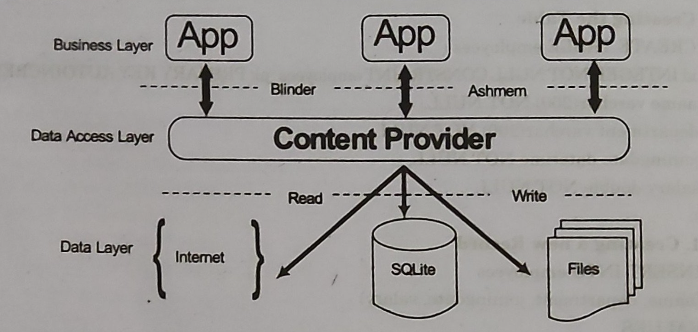

# Supported Storage in Android
1. **Internal Memory:** Store private data on device memory.
2. **External Memory:** Store public data on external shared memory.
3. **Shared Preferences:** Store private data in key value pair.
4. **Network:** Store data on the web with you own network.

# Content Provider:
- Content provider component used to supply data from one application to other on request.
- Content provider can store data in different places such as database, in files, or even  over network.
- Content providers let you centralize content in one place and have many applications access it as needed. 
- A content provider behaves very much like a database where you can query it, edit its content, as well as add or delete content using insert, updateD, delete, and query methods.
- In most cases, this data is stored in aSQlite database.

