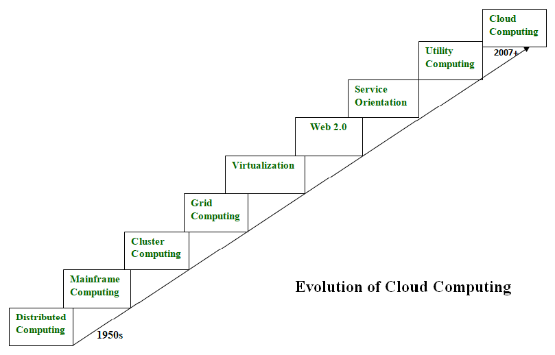

# Cloud Computing
CC is **on-demand** availability of computer resources, especially data storages and computing powers over the internet with **pay-as-you-go** pricing.
Instead of buying, owning, maintaining physical data centres and servers, one can access technology services, such as computing power, storage, and databases on an **as-needed** basis  from a CSP.
Referred to as a **Internet-based computing**.

# Benefits of Cloud Computing
1. Reduce Investment
2. Increase Availability 
3. Increase Reliability
4. Increase Scalability
	- Scale Down & Scale Up 
5. Data Loss Prevention
	- Offers backup and disaster recovery feature.
6. Advanced Security
	- Depth and breadth security maintenance and centralized management.
	- CSP hires top security experts

# Characteristics of Cloud Computing
1. Cost Reduction
2. Device and Location independence
3. On Demand Self Service
4. Maintenance
5. Security and Reliability
6. Measured Service
7. Resource Pooling
	- Multiple clients are provided service from a same physical resource.
8. Flexible Pricing Model.
	- Offers Pay-per-use, subscription-based, and spot-pricing.
9. Virtualisation
10. Automation

# Application of Cloud Computing
1. Online Storage and Backup application
2. Photo and Video Editing software
3. Entertainment Application
4. Management Application
5. Education Application
6. Business Application
7. Social Application

# Challenges of Cloud Computing
1. **Data Security and Privacy** : Even if CSP assures data security and integrity, it's your responsibility to carry out user authentication, authorisation, and identity management. Includes data breach, malware infection, and lot more which eventually decreases the trust amongst the user of your application.
2. **Multi-cloud environment** : 84% of companies are dependent on multi-cloud. This often ends up being hindering and difficult for the IT team due to difference between multiple cloud providers.
3. **Cost Management** : Ensure to scale up and scale down the resources on need basis.
4. **Performance Challenges** : A little latency in performance due to any of cloud server issue results in huge user drop.
5. **Interoperability and flexibility** : Lack of flexibility from switching from one cloud to another cloud due to complexity involved.
6. **High Dependence on Network**.
7. **Lack of knowledge and expertise**.

# Evolution of Cloud Computing #revise 
Cloud computing is all about renting computing services. This idea first came in the 1950s. In making cloud computing what it is today, ==five technologies== played a vital role. These are distributed systems and its peripherals, virtualisation, web 2.0, service orientation, and utility computing.

1. **Distributed System :** It is a composition of multiple independent systems but all of them are depicted as a single entity to the users.But the main problem with this system was that all the systems were required to be present at the same geographical location. Thus to solve this problem, distributed computing led to three more types of computing and they were-Mainframe computing, cluster computing, and grid computing.
2. **Mainframe Computer :** Responsible for handling large input output operation. Even today used for online transaction. They were very expensive, to reduce the cost cluster computing came as an alternative of it.
3. **Cluster Computing :** Each machine in this is connected to each other a network with high bandwidth. New nodes can be easily added on need. Cheaper than mainframe and equally powerful. The problem of cost got sorted here but geographical problem was still there.
4. **Grid Computing :** Different systems were placed at entirely different geographical locations and these all were connected via the internet. It solved the previous problem but new problem encountered was low availability of high bandwidth, thus CC is also termed as "Successor of Grid Computing".
5. **Virtualisation :** The process of adding layers over the hardware which allows users to run multiple instances simultaneously. It is the base of various CC services such as Amazon EC2, VMWare, vCloud, etc.
6. **Web 2.0 :** It is the interface through which the cloud computing services interact with the clients. It is because of Web 2.0 that we have interactive and dynamic web pages. It also increases flexibility among web pages. Popular examples of web 2.0 include Google Maps, Facebook, Twitter, etc.
7. **Service Orientation :** It acts as a reference model for cloud computing. It supports low-cost, flexible, and evolvable applications. Two important concepts were introduced in this computing model. These were Quality of Service (QoS) which also includes the SLA (Service Level Agreement) and Software as a Service (SaaS). #revise
8. **Utility Computing :** - It is a computing model that defines service provisioning techniques for services such as compute services along with other major services such as storage, infrastructure, etc which are provisioned on a pay-per-use basis.