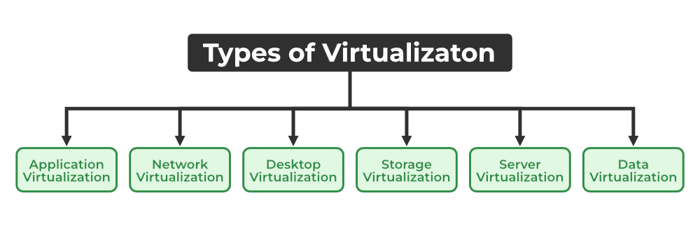

# Virtualization
Virtualization is the process of creating a virtual version of something, such as a server, a desktop, a storage device, an operating system, or a net resource.
- It is a technique, which allows sharing single physical instance of a resource or an application to multiple users or organizations.
- It does by assigning a local name to the physical storage and providing a pointer to the physical resources when needed.
- The machine on the virtual machines are going to create is called **Host Machine** and that virtual machines are referred as **Guest Machine**.
- A VMM program(hypervisor) is installed and executed to create and manage the Virtual Machines on the host Machine.

## Drawbacks
- High Investment
- Learning new infrastructure – requires skilled staffs.
- Risk of data.

## Benefits
- Flexible and efficient allocation of resources.
- Enhance development productivity.
- Lowers the cost of IT infrastructure.
- Remote access and rapid scalability.
- Highly availability and disaster recovery.
- Pay–per–use of the IT infrastructure on demand.
- Enable running multiple operating system.

# Types of Virtualization

## 1. Application Virtualization
- When VMM is directly installed on Hardware System.
- The main job of the Hypervisor is to control and monitoring the processor, memory, and other hardware resources.
- After virtualization of hardware system, we can install different operating system on it and run different applications on those O/S.
- **Usage:** – Hardware virtualization is mainly done for the server platforms, because controlling virtual machines is much easier than controlling a physical server.

## 2. Operating System Virtualization
- When VMM is installed on Host Operating System.
- **Usage** – mainly used for testing application on different platforms of O/S.

## 3. Server Virtualization
- When VMM is installed on Server System.
- **Usage** – It is done because a single physical server can be divided into multiple server on demand basis and for balancing loads.

## 4. Storage Virtualization
- It is the process of grouping the physical storage from multiple network storage devices so that it looks like a single storage device.
- Implemented by using software application.
- **Usage** – Mainly done for backup and recovery purposes.

# Hypervisor
- A hypervisor is a form of virtualization software used in Cloud hosting to divide and allocate the resources on various pieces of hardware. 
- The program which provides partitioning, isolation, or abstraction is called a virtualization hypervisor.
- The hypervisor is a hardware virtualization technique that allows multiple guest operating systems (OS) to run on a single host system at the same time.
- A hypervisor is sometimes also called a virtual machine manager(VMM).

## Type 1 Hypervisor
- It runs directly on the underlying host system.
- Also known as **Native Hypervisor** or **Bare Metal Hypervisor**.
- Does not require any base server O/S.
- Has direct access to hardware resources.
- Example – **VMware ESXi, Citrix Zen Server.**

## Type 2 Hypervisor 
- Instead of directly running on the underlying host system, they run as an application on the host system.
- Hypervisor asks the operating system to make hardware calls.
- Example – **VMware Player, Parallel Desktop.**