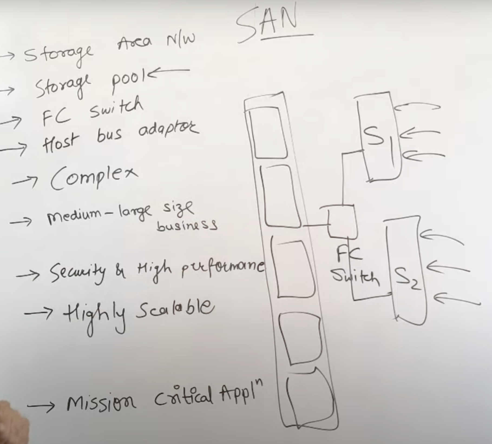

# Cloud Storage
It is a service model in which data are transmitted and stored over remote storage system where it is maintained, managed, backed up and make available to user over internet.
- Based on infrastructure virtualization with accessible interface.
- With the help of RESTful APIs, users can access and retrieve data from cloud storage.
### Advantages
- Pay–as–you–go based.
- Utility billing.
- Global availability.
- Ease of use.
- Recovery, security, and accessibility.
### Disadvantages
- Backup may be slower.
- Higher internet utilization.
- Privacy Concerns.

## Types of Cloud Storage
### 1. Block-Based Storage
- Hard Drives are block based. O/S sees a drive on which you can create a volume, and then one can partition that volume and format them.
- For example, If a system has 1000 GB of volume, then we can partition it into 800 GB and 200 GB for local C and local D drive respectively.
### 2. File Based System
- In this, you are actually connecting through a Network Interface Card (NIC). You are going over a network, and then you can access the network-attached storage server (NAS). NAS devices are file-based storage systems.
- This storage server is another computing device that has another disk in it. It is already created a file system so that it’s already formatted its partitions, and it will share its file systems over the network.
### 3. Object Based System
- In this, a user uploads objects using a web browser and uploading an object to a container, i.e, Object Storage Container. This uses the HTTP Protocols with the rest of the APIs (example: GET, PUT, POST, SELECT, DELETE).
- For example, when you connect to any website, and you need to download some images, text, or anything that the website contains. For that, it is a code HTTP GET request. If you want to review any product, then you can use PUT and POST requests.

# Storage as a Service(STaaS)
CC service model that delivers Cloud Storage to individuals or organizations over the internet.
- Organizations that use a STaaS model can store and back up massive amounts of data in various formats and access information as necessary.
- User can store data in cloud storage in 3 different formats that are mentioned above.
- **AWS, Azure, Google Cloud, Oracle Cloud** are some examples of STaaS.
### Benefits
1. Cost Effective.
2. Scalability.
3. Reliability.
4. Availability.
5. Security.
### Challenges
1. Vendor lock–in.
2. Data Security.
3. Performance.

# Storage Area Networks(SAN)
- It is specialized network architecture that provides block-level storage access to servers and application.
- Uses specialized hardware and software to provide storage connectivity between servers and storage devices, such as **Fiber Channel(FC) switch** or **iSCSI**.
- 
### Advantages
1. Centralized Management.
2. Data Protection.
### Disadvantages
1. Expensive.
2. Network Dependency.
3. Security Risks – due to network